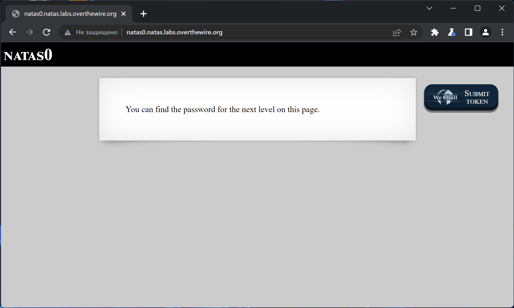
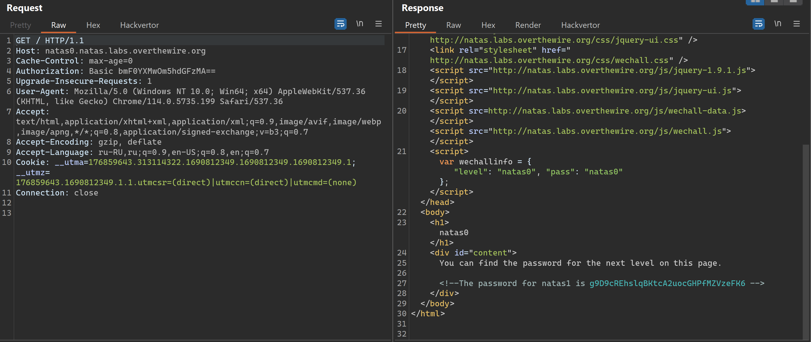

# NATAS_0 WriteUp
:computer: Host: http://natas0.natas.labs.overthewire.org/  
:bust_in_silhouette: Usename: natas0  
:lock: Password: natas0

:triangular_flag_on_post: Flag: g9D9cREhslqBKtcA2uocGHPfMZVzeFK6

## Обзор веб-приложения
Веб-приложение выглядит следующим образом

Функционал не представлен никакой

## Решение
В HTML коде страницы содержится комментарий, который содержит пароль от следующей лабораторки

Полученный флаг: g9D9cREhslqBKtcA2uocGHPfMZVzeFK6