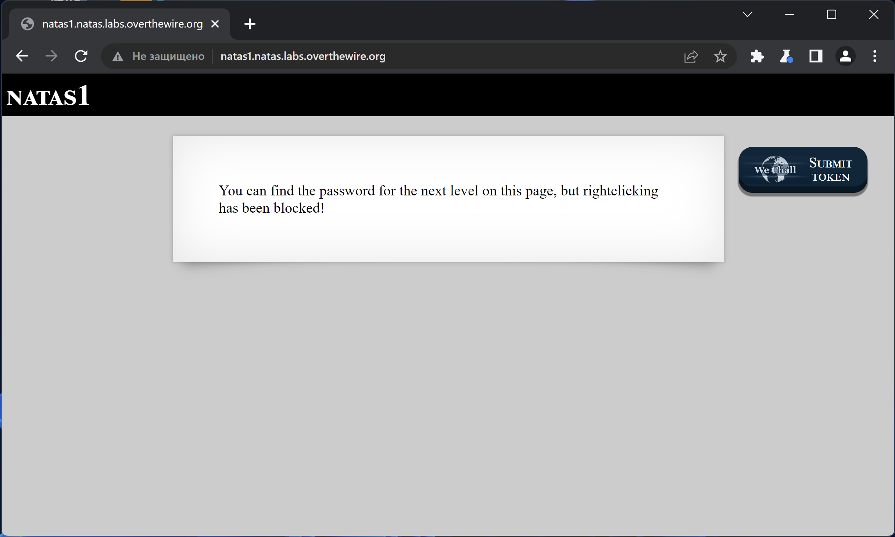
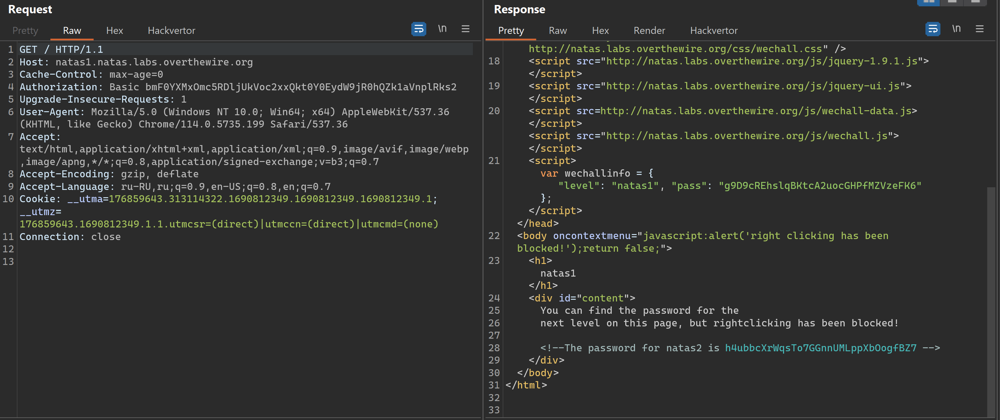

# NATAS_1 WriteUp
:computer: Host: http://natas1.natas.labs.overthewire.org/  
:bust_in_silhouette: Usename: natas1  
:key: Password: g9D9cREhslqBKtcA2uocGHPfMZVzeFK6

:triangular_flag_on_post: Flag: h4ubbcXrWqsTo7GGnnUMLppXbOogfBZ7

- [NATAS\_1 WriteUp](#natas_1-writeup)
  - [Обзор веб-приложения](#обзор-веб-приложения)
  - [Решение](#решение)

## Обзор веб-приложения
 
Веб-приложение выглядит следующим образом

Функционал не представлен никакой

## Решение

В HTML коде страницы содержится комментарий, который содержит пароль от следующей лабораторки

Полученный флаг: h4ubbcXrWqsTo7GGnnUMLppXbOogfBZ7