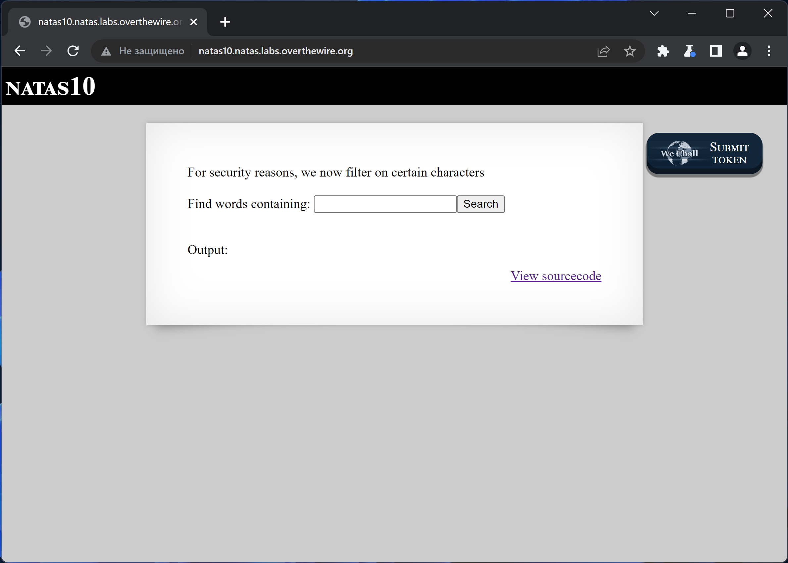
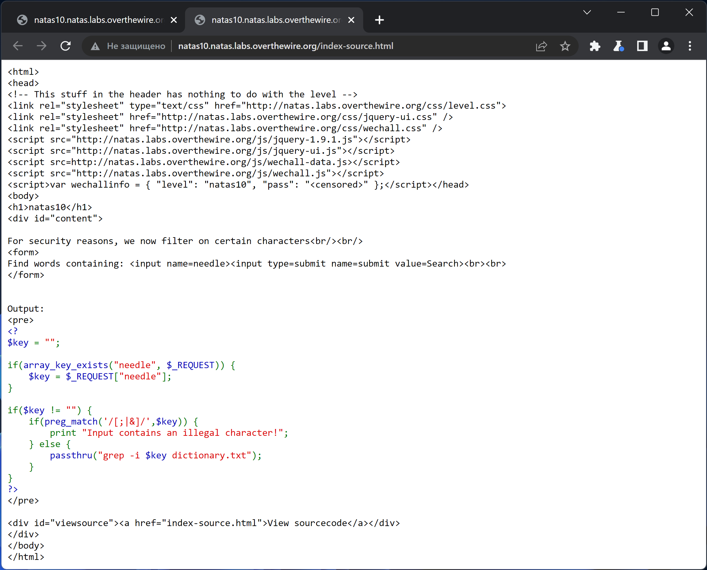

# NATAS_10 WriteUp
:computer: Host: http://natas10.natas.labs.overthewire.org/  
:bust_in_silhouette: Usename: natas10  
:key: Password: D44EcsFkLxPIkAAKLosx8z3hxX1Z4MCE

:triangular_flag_on_post: Flag: 1KFqoJXi6hRaPluAmk8ESDW4fSysRoIg

## Обзор веб-приложения
Веб-приложение выглядит следующим образом

Ввод слова ``test`` привёл к вот такой реакции 

Кнопка <kbd>**View sourcecode**</kbd> позволяет просмотреть исходный код страницы

## Решение
В исходном коде веб-приложения видим фильтр символов `` [ ; | & ] ``, что не позволяет нам встроить свою команду на исполнение  

В данном случае мы вынуждены нарушить логику работы команды ``grep`` таким образом, чтобы она вывела нам флаг  

:space_invader: Payload: ``-r .* /etc/natas_webpass/ # ``  

Полученный флаг: 1KFqoJXi6hRaPluAmk8ESDW4fSysRoIg
