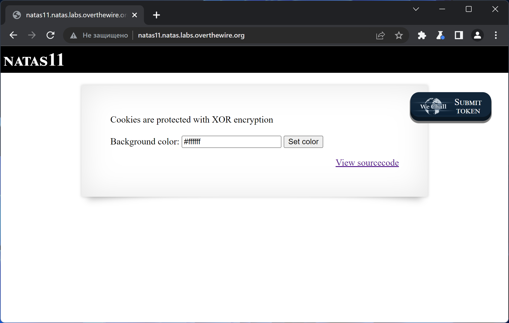
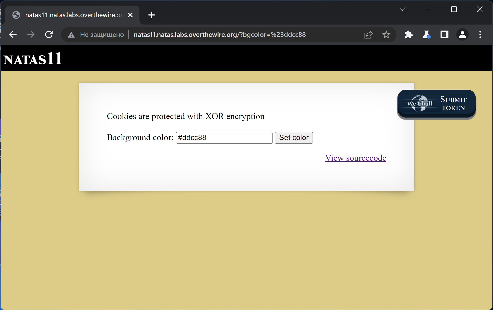
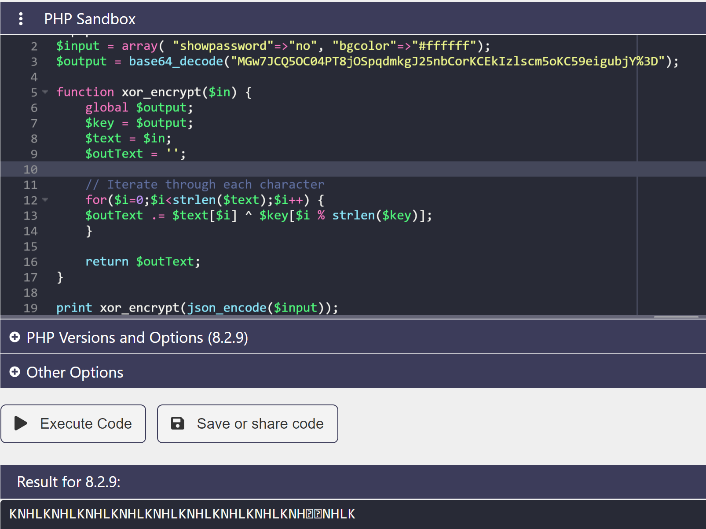
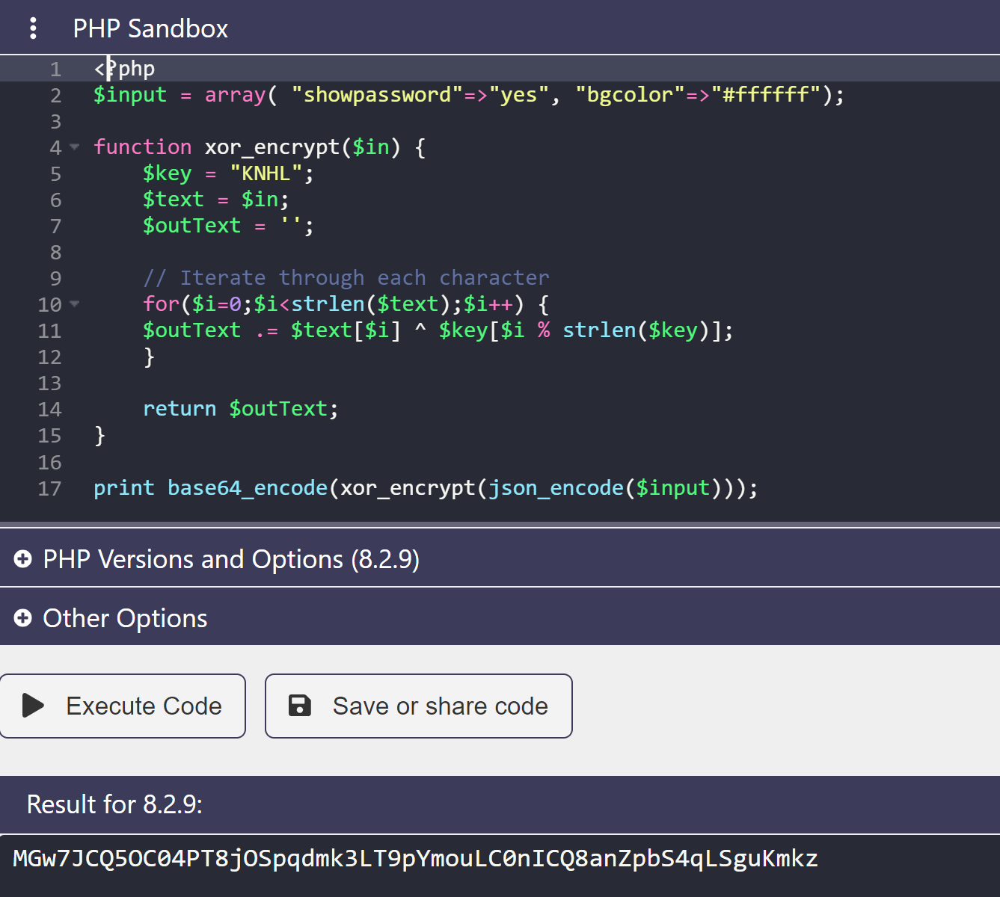
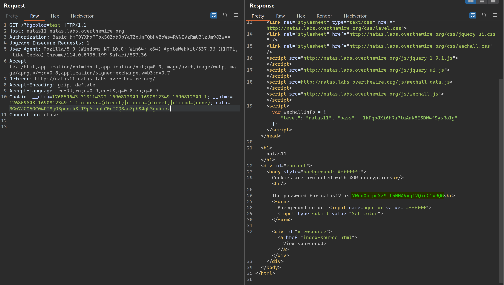

# NATAS_11 WriteUp
:computer: Host: http://natas11.natas.labs.overthewire.org/  
:bust_in_silhouette: Usename: natas11  
:key: Password: 1KFqoJXi6hRaPluAmk8ESDW4fSysRoIg

:triangular_flag_on_post: Flag: YWqo0pjpcXzSIl5NMAVxg12QxeC1w9QG

- [NATAS\_11 WriteUp](#natas_11-writeup)
  - [Обзор веб-приложения](#обзор-веб-приложения)
  - [Решение](#решение)

## Обзор веб-приложения
<a name="Обзор_веб-приложения"></a> 
Веб-приложение выглядит следующим образом


Форма ввода на главной странице позволяет менять цвет фона страницы 


Кнопка <kbd>**View sourcecode**</kbd> позволяет просмотреть исходный код страницы
```php
// HTML code ...
<?
$defaultdata = array( "showpassword"=>"no", "bgcolor"=>"#ffffff");

function xor_encrypt($in) {
    $key = '<censored>';
    $text = $in;
    $outText = '';

    // Iterate through each character
    for($i=0;$i<strlen($text);$i++) {
    $outText .= $text[$i] ^ $key[$i % strlen($key)];
    }

    return $outText;
}

function loadData($def) {
    global $_COOKIE;
    $mydata = $def;
    if(array_key_exists("data", $_COOKIE)) {
    $tempdata = json_decode(xor_encrypt(base64_decode($_COOKIE["data"])), true);
    if(is_array($tempdata) && array_key_exists("showpassword", $tempdata) && array_key_exists("bgcolor", $tempdata)) {
        if (preg_match('/^#(?:[a-f\d]{6})$/i', $tempdata['bgcolor'])) {
        $mydata['showpassword'] = $tempdata['showpassword'];
        $mydata['bgcolor'] = $tempdata['bgcolor'];
        }
    }
    }
    return $mydata;
}

function saveData($d) {
    setcookie("data", base64_encode(xor_encrypt(json_encode($d))));
}

$data = loadData($defaultdata);
if(array_key_exists("bgcolor",$_REQUEST)) {
    if (preg_match('/^#(?:[a-f\d]{6})$/i', $_REQUEST['bgcolor'])) {
        $data['bgcolor'] = $_REQUEST['bgcolor'];
    }
}
saveData($data);
?>
// HTML code ...
<?
if($data["showpassword"] == "yes") {
    print "The password for natas12 is <censored><br>";
}
?>
// HTML code ...
```

## Решение
<a name="Решение"></a>
Веб-приложение покажет нам флаг, если на вход ему будет передан параметр **showpassword** равный **yes**  
```php
if($data["showpassword"] == "yes") {
    print "The password for natas12 is <censored><br>";
}
```
Этот параметр вместе с цветом фона страницы передаётся в куке **data** в зашифрованном виде, будучи, при том, неизменным (взятым из неизменяющейся переменной ```$defaultdata```)
```php
$defaultdata = array( "showpassword"=>"no", "bgcolor"=>"#ffffff");
    ...
$data = loadData($defaultdata);

if(array_key_exists("bgcolor",$_REQUEST)) {
    if (preg_match('/^#(?:[a-f\d]{6})$/i', $_REQUEST['bgcolor'])) {
        $data['bgcolor'] = $_REQUEST['bgcolor'];
    }
}

saveData($data);   

```
```php
function saveData($d) {
    setcookie("data", base64_encode(xor_encrypt(json_encode($d))));
}
```
```php
function xor_encrypt($in) {
    $key = '<censored>';
    $text = $in;
    $outText = '';

    // Iterate through each character
    for($i=0;$i<strlen($text);$i++) {
    $outText .= $text[$i] ^ $key[$i % strlen($key)];
    }

    return $outText;
}
```
Мы видим, что функция ```saveData($data)``` выполняет упаковку данных с помощью шифрования функцией ``xor_encrypt`` и последующей конвертации куки **data** в base64 кодировку. Соответственно, чтобы отправить серверу куку с закодированным в неё ``showpassword=yes``, нужно повторить описанный процесс шифрования, подав ему на вход нужные нам исходные данные

Для этого необходимо узнать ключ, который нам не раскрывают
```php
function xor_encrypt($in) {
    $key = '<censored>';
    ...
}
```
К счастью, зная входные и выходные данные, можно восстановить ключ, по которому проводилось шифрование  
| Input |  Key  | Output |
|:-----:|:-----:|:------:|
|   0   |   0   |    0   |
|   0   |   1   |    1   |
|   1   |   0   |    1   |
|   1   |   1   |    0   |

**Input** XOR **Key** = **Output**  
**Key** = **Input** XOR **Output**

**Input** = ``{"showpassword":"no","bgcolor":"#ffffff"}``  
**Output** = ``base64_decode(MGw7JCQ5OC04PT8jOSpqdmkgJ25nbCorKCEkIzlscm5oKC59eigubjY%3D)`` = ``0l;$$98-8=?#9*jvi 'ngl*+(!$#9lrnh(.}z(.bjY%3D``

**Key** = ``KNHL``


Получив ключ шифрования, мы можем, наконец, зашифровать нужное нам сообщение



Полученный флаг: YWqo0pjpcXzSIl5NMAVxg12QxeC1w9QG
