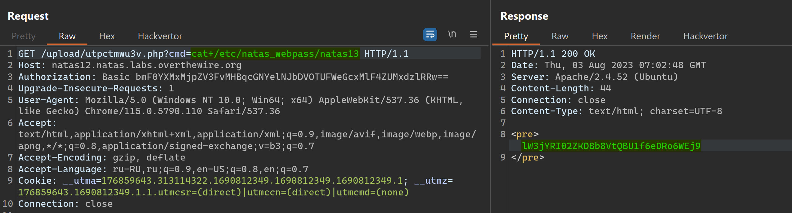

# NATAS_12 WriteUp
:computer: Host: http://natas12.natas.labs.overthewire.org/  
:bust_in_silhouette: Usename: natas12  
:lock: Password: YWqo0pjpcXzSIl5NMAVxg12QxeC1w9QG

:triangular_flag_on_post: Flag: lW3jYRI02ZKDBb8VtQBU1f6eDRo6WEj9

## Обзор веб-приложения
Веб-приложение выглядит следующим образом


Функционал загрузки файлов позволяет загружать только фотографии с форматом **.jpg**  
По какой-то причине загрузка фоток не работает как должно... 


Кнопка <kbd>**View sourcecode**</kbd> позволяет просмотреть исходный код страницы
```php
// HTML Code ...
<?php
function genRandomString() {
    $length = 10;
    $characters = "0123456789abcdefghijklmnopqrstuvwxyz";
    $string = "";

    for ($p = 0; $p < $length; $p++) {
        $string .= $characters[mt_rand(0, strlen($characters)-1)];
    }
    return $string;
}

function makeRandomPath($dir, $ext) {
    do {
    $path = $dir."/".genRandomString().".".$ext;
    } while(file_exists($path));
    return $path;
}

function makeRandomPathFromFilename($dir, $fn) {
    $ext = pathinfo($fn, PATHINFO_EXTENSION);
    return makeRandomPath($dir, $ext);
}

if(array_key_exists("filename", $_POST)) {
    $target_path = makeRandomPathFromFilename("upload", $_POST["filename"]);
        if(filesize($_FILES['uploadedfile']['tmp_name']) > 1000) {
        echo "File is too big";
    } 
    else {
        if(move_uploaded_file($_FILES['uploadedfile']['tmp_name'], $target_path)) {
            echo "The file <a href=\"$target_path\">$target_path</a> has been uploaded";
        } else{
            echo "There was an error uploading the file, please try again!";
        }
    }
} 
else {
?>
<form enctype="multipart/form-data" action="index.php" method="POST">
<input type="hidden" name="MAX_FILE_SIZE" value="1000" />
<input type="hidden" name="filename" value="<?php print genRandomString(); ?>.jpg" />
Choose a JPEG to upload (max 1KB):<br/>
<input name="uploadedfile" type="file" /><br />
<input type="submit" value="Upload File" />
</form>
<?php } ?>
// HTML Code ...
```

## Решение

Мы видим, что расширение загружаемого файла берётся из отправляемого пользователем POST параметра **filename**
```php
if(array_key_exists("filename", $_POST)) {
    $target_path = makeRandomPathFromFilename("upload", $_POST["filename"]);
    // ...
}
```
```php
function makeRandomPathFromFilename($dir, $fn) {
    $ext = pathinfo($fn, PATHINFO_EXTENSION);
    return makeRandomPath($dir, $ext);
}
```

Следовательно, мы можем загружать PHP web-shell (подменив расширение загружаемого файла, чтобы он сохранился, как веб-страничка .php)  


Перейдём по указанному url и получим доступ к исполнению команд на сервере  
Следующий шаг - получить флаг


Полученный флаг: !!lW3jYRI02ZKDBb8VtQBU1f6eDRo6WEj9!!
