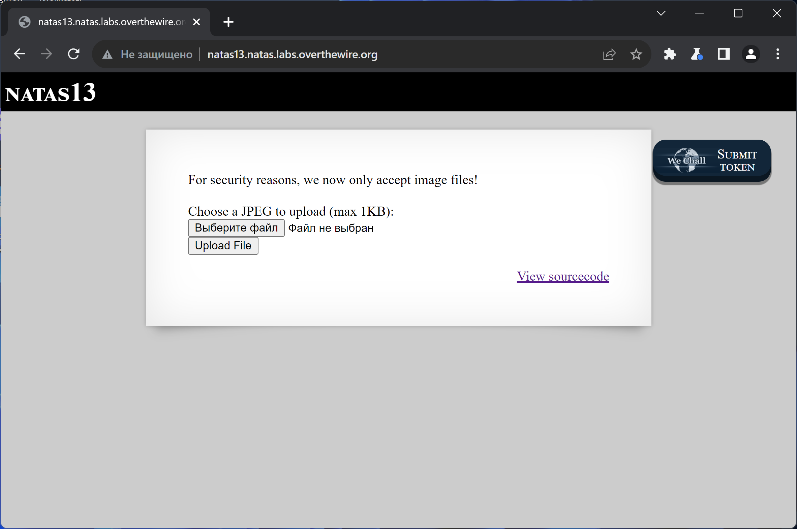
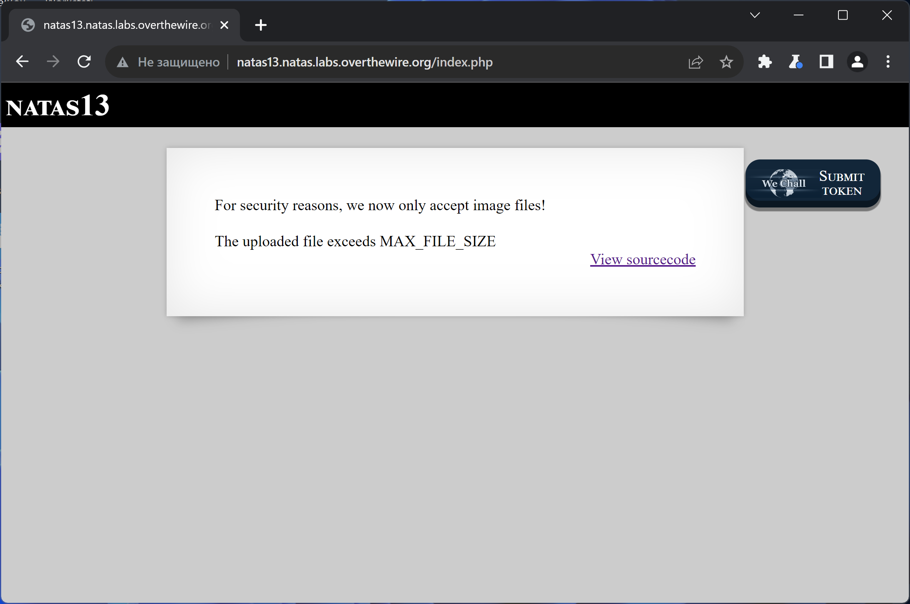
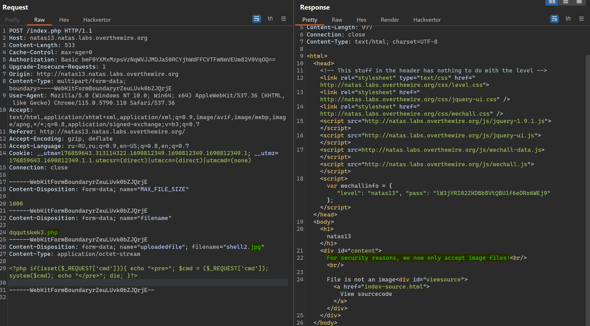
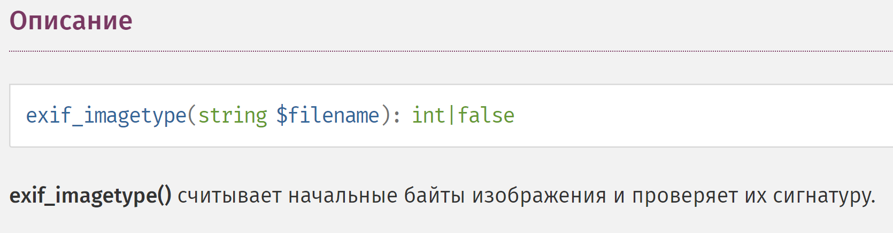
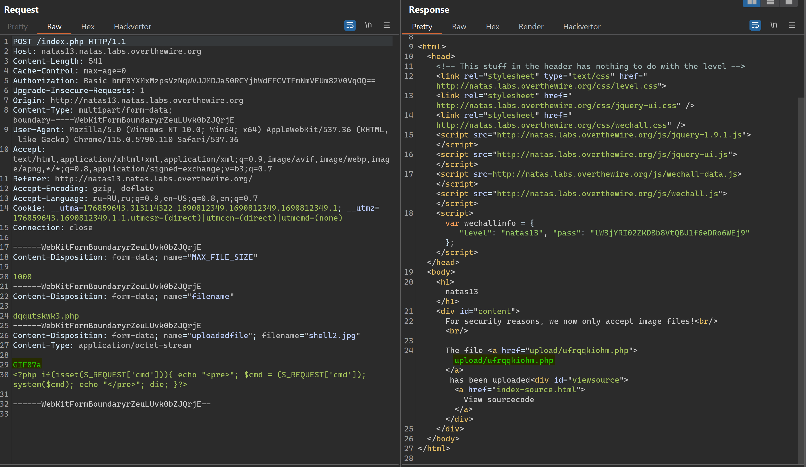
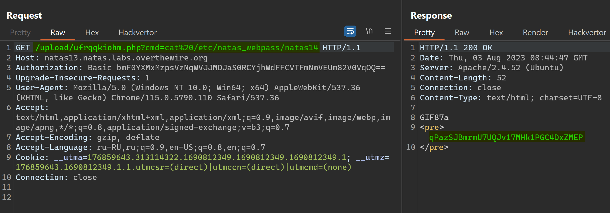

# NATAS_13 WriteUp
:computer: Host: http://natas13.natas.labs.overthewire.org/  
:bust_in_silhouette: Usename: natas13  
:key: Password: lW3jYRI02ZKDBb8VtQBU1f6eDRo6WEj9

:triangular_flag_on_post: Flag: qPazSJBmrmU7UQJv17MHk1PGC4DxZMEP
 
- [NATAS\_13 WriteUp](#natas_13-writeup)
  - [Обзор веб-приложения](#обзор-веб-приложения)
  - [Решение](#решение)

## Обзор веб-приложения
<a name="Обзор_веб-приложения"></a> 
Веб-приложение выглядит следующим образом


Загрузка файла постоянно ругается на размер файла.. Загрузить фотографию у меня так и не получилось (да это и не требуется)


Кнопка <kbd>**View sourcecode**</kbd> позволяет просмотреть исходный код страницы
```php
// HTML Code ...
<?php
function genRandomString() {
    $length = 10;
    $characters = "0123456789abcdefghijklmnopqrstuvwxyz";
    $string = "";

    for ($p = 0; $p < $length; $p++) {
        $string .= $characters[mt_rand(0, strlen($characters)-1)];
    }

    return $string;
}

function makeRandomPath($dir, $ext) {
    do {
    $path = $dir."/".genRandomString().".".$ext;
    } while(file_exists($path));
    return $path;
}

function makeRandomPathFromFilename($dir, $fn) {
    $ext = pathinfo($fn, PATHINFO_EXTENSION);
    return makeRandomPath($dir, $ext);
}

if(array_key_exists("filename", $_POST)) {
    $target_path = makeRandomPathFromFilename("upload", $_POST["filename"]);
    $err=$_FILES['uploadedfile']['error'];
    if($err){
        if($err === 2){
            echo "The uploaded file exceeds MAX_FILE_SIZE";
        } else{
            echo "Something went wrong :/";
        }
    } else if(filesize($_FILES['uploadedfile']['tmp_name']) > 1000) {
        echo "File is too big";
    } else if (! exif_imagetype($_FILES['uploadedfile']['tmp_name'])) {
        echo "File is not an image";
    } else {
        if(move_uploaded_file($_FILES['uploadedfile']['tmp_name'], $target_path)) {
            echo "The file <a href=\"$target_path\">$target_path</a> has been uploaded";
        } else{
            echo "There was an error uploading the file, please try again!";
        }
    }
} else {
?>
<form enctype="multipart/form-data" action="index.php" method="POST">
<input type="hidden" name="MAX_FILE_SIZE" value="1000" />
<input type="hidden" name="filename" value="<?php print genRandomString(); ?>.jpg" />
Choose a JPEG to upload (max 1KB):<br/>
<input name="uploadedfile" type="file" /><br />
<input type="submit" value="Upload File" />
</form>
<?php } ?>
// HTML Code ...
```


## Решение
<a name="Решение"></a>
Очевидно, здесь снова требуется проэксплуатировать уязвимость **File Upload**  
Старый трюк с подменой расширения файла не работает...  


Читаем исходный код приложения и видим, что добавилась ещё одна проверка
```php
// ...
else if (! exif_imagetype($_FILES['uploadedfile']['tmp_name'])) {
        echo "File is not an image";
    }
// ...
```

Эта функция описана в документации по PHP


Значит, гуглим фразу **magic bytes** и вписываем в начало файла, например, сигнатуру формата **.gif**


После чего, используем загруженный web-shell для получения флага


Полученный флаг: qPazSJBmrmU7UQJv17MHk1PGC4DxZMEP
