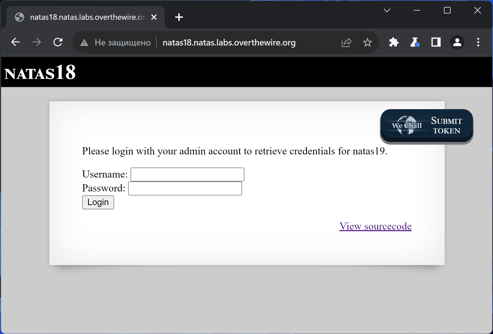
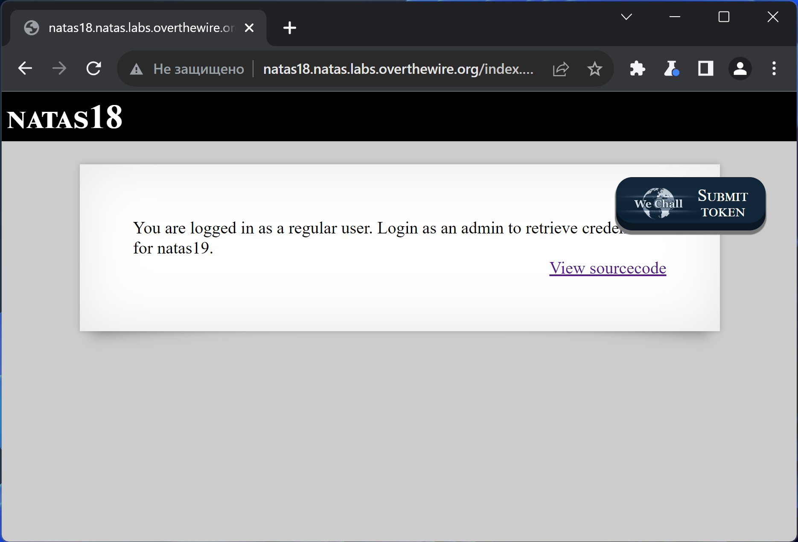
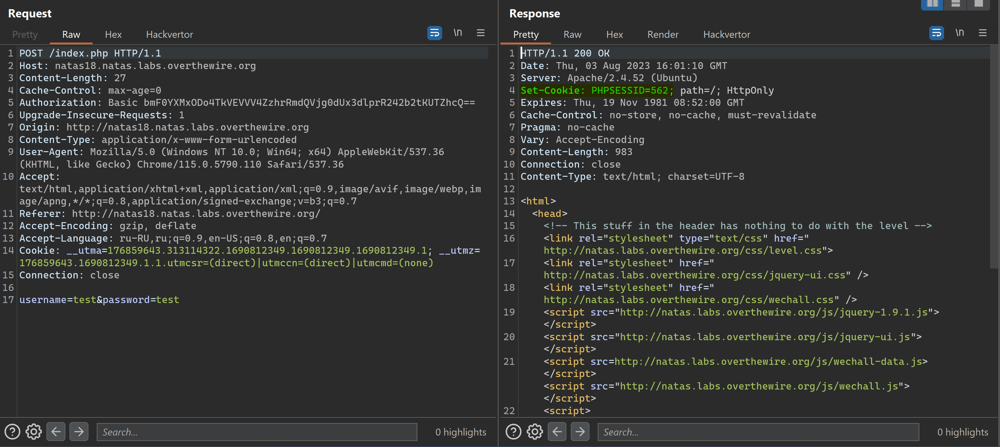
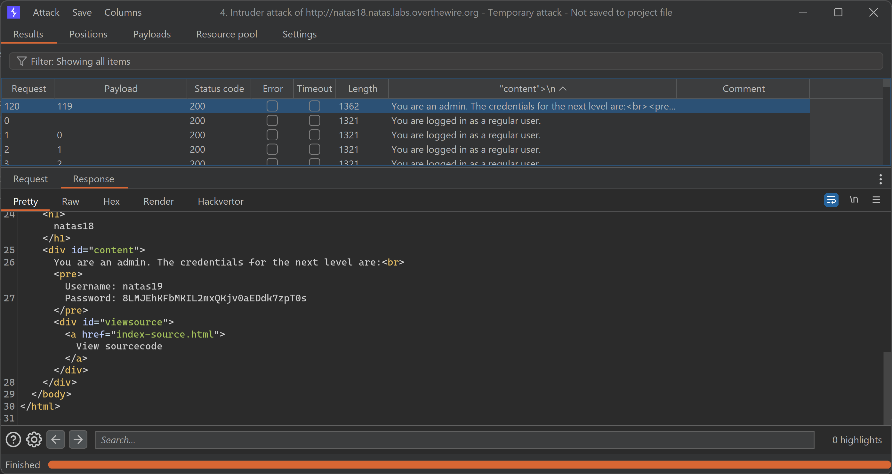

# NATAS_18 WriteUp
:computer: Host: http://natas18.natas.labs.overthewire.org/  
:bust_in_silhouette: Usename: natas18  
:key: Password: 8NEDUUxg8kFgPV84uLwvZkGn6okJQ6aq

:triangular_flag_on_post: Flag: 8LMJEhKFbMKIL2mxQKjv0aEDdk7zpT0s
 
- [NATAS\_18 WriteUp](#natas_18-writeup)
  - [Обзор веб-приложения](#обзор-веб-приложения)
  - [Решение](#решение)

## Обзор веб-приложения
<a name="Обзор_веб-приложения"></a> 
Веб-приложение выглядит следующим образом


Ввод учётных данных **test:test** приводит к вот такой реакции


Кнопка <kbd>**View sourcecode**</kbd> позволяет просмотреть исходный код страницы
```php
// HTML Code ...
<?php
$maxid = 640; // 640 should be enough for everyone

function isValidAdminLogin() { /* {{{ */
    if($_REQUEST["username"] == "admin") {
    /* This method of authentication appears to be unsafe and has been disabled for now. */
        //return 1;
    }
    return 0;
}
/* }}} */
function isValidID($id) { /* {{{ */
    return is_numeric($id);
}
/* }}} */
function createID($user) { /* {{{ */
    global $maxid;
    return rand(1, $maxid);
}
/* }}} */
function debug($msg) { /* {{{ */
    if(array_key_exists("debug", $_GET)) {
        print "DEBUG: $msg<br>";
    }
}
/* }}} */
function my_session_start() { /* {{{ */
    if(array_key_exists("PHPSESSID", $_COOKIE) and isValidID($_COOKIE["PHPSESSID"])) {
    if(!session_start()) {
        debug("Session start failed");
        return false;
    } else {
        debug("Session start ok");
        if(!array_key_exists("admin", $_SESSION)) {
        debug("Session was old: admin flag set");
        $_SESSION["admin"] = 0; // backwards compatible, secure
        }
        return true;
    }
    }
    return false;
}
/* }}} */
function print_credentials() { /* {{{ */
    if($_SESSION and array_key_exists("admin", $_SESSION) and $_SESSION["admin"] == 1) {
    print "You are an admin. The credentials for the next level are:<br>";
    print "<pre>Username: natas19\n";
    print "Password: <censored></pre>";
    } else {
    print "You are logged in as a regular user. Login as an admin to retrieve credentials for natas19.";
    }
}
/* }}} */

$showform = true;
if(my_session_start()) {
    print_credentials();
    $showform = false;
} else {
    if(array_key_exists("username", $_REQUEST) && array_key_exists("password", $_REQUEST)) {
    session_id(createID($_REQUEST["username"]));
    session_start();
    $_SESSION["admin"] = isValidAdminLogin();
    debug("New session started");
    $showform = false;
    print_credentials();
    }
}
if($showform) {
?>

<p>
Please login with your admin account to retrieve credentials for natas19.
</p>
<form action="index.php" method="POST">
Username: <input name="username"><br>
Password: <input name="password"><br>
<input type="submit" value="Login" />
</form>
<?php } ?>
// HTML Code ...
```

## Решение
<a name="Решение"></a>
Веб-приложение после попытки логина отдаёт мне куку с идентификатором сессии  


Кука представляет из себя числовое значение, и первое что стоит сделать - перебрать различные значения  

Флаг достался сам собой :satisfied:

Полученный флаг: 8LMJEhKFbMKIL2mxQKjv0aEDdk7zpT0s
