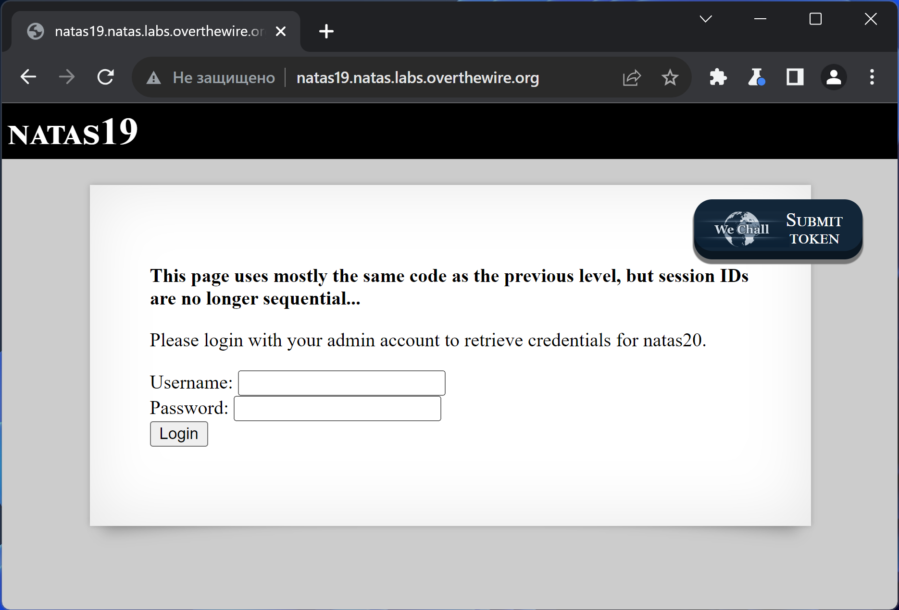
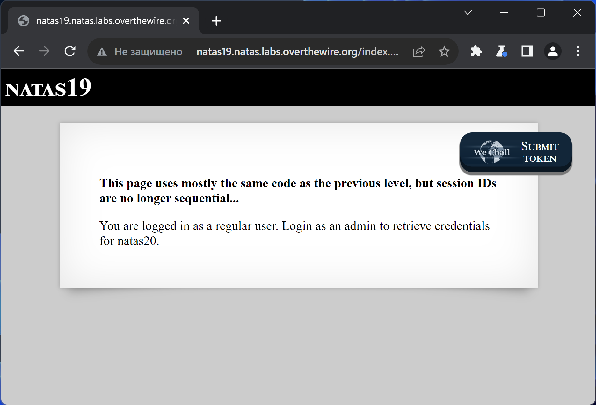
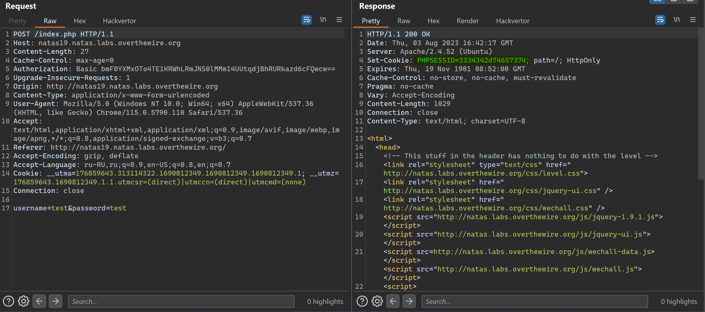
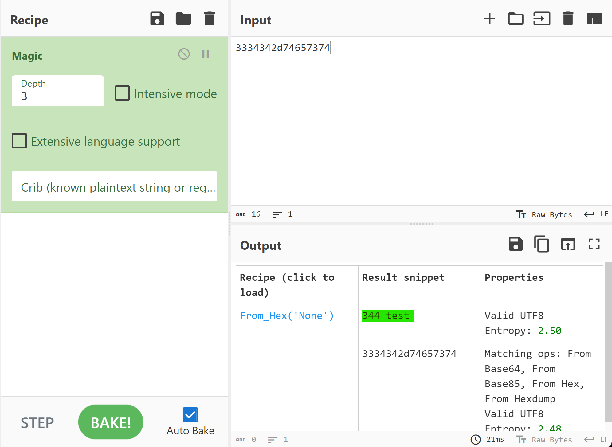
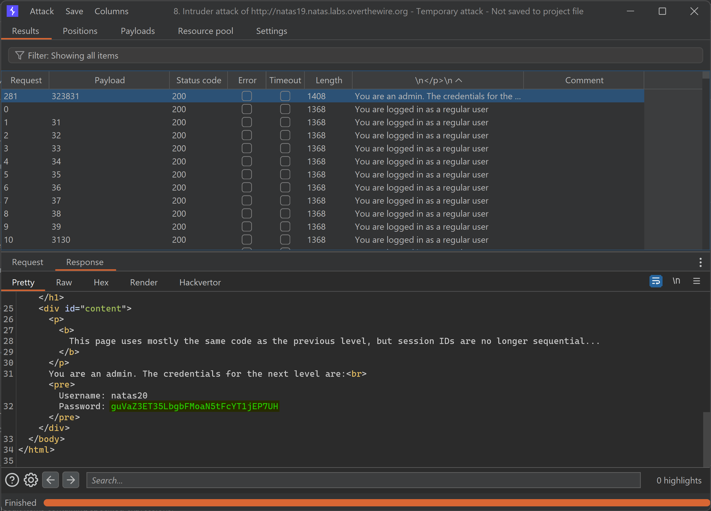

# NATAS_19 WriteUp
:computer: Host: http://natas19.natas.labs.overthewire.org/  
:bust_in_silhouette: Usename: natas19  
:key: Password: 8LMJEhKFbMKIL2mxQKjv0aEDdk7zpT0s

:triangular_flag_on_post: Flag: guVaZ3ET35LbgbFMoaN5tFcYT1jEP7UH
 
- [NATAS\_19 WriteUp](#natas_19-writeup)
  - [Обзор веб-приложения](#обзор-веб-приложения)
  - [Решение](#решение)

## Обзор веб-приложения
 
Веб-приложение выглядит следующим образом

Ввод учётных данных **test:test** приводит к вот такой реакции

Кнопки <kbd>**View sourcecode**</kbd> на этот раз нет :sweat_smile:

## Решение

Взглянем на полученную куку снова  

Сразу и не поймёшь что это такое, однако CyberChef творит чудеса  

Выходит, на этот раз куку слепили из такого же рандомного трёхзначного числа и введённого логина  
Немедленно повторяем процедуру брутфорса

Перебор завершился успешно
:space_invader: Payload: ``PHPSESSID=3238312d61646d696e`` 

Полученный флаг: guVaZ3ET35LbgbFMoaN5tFcYT1jEP7UH
