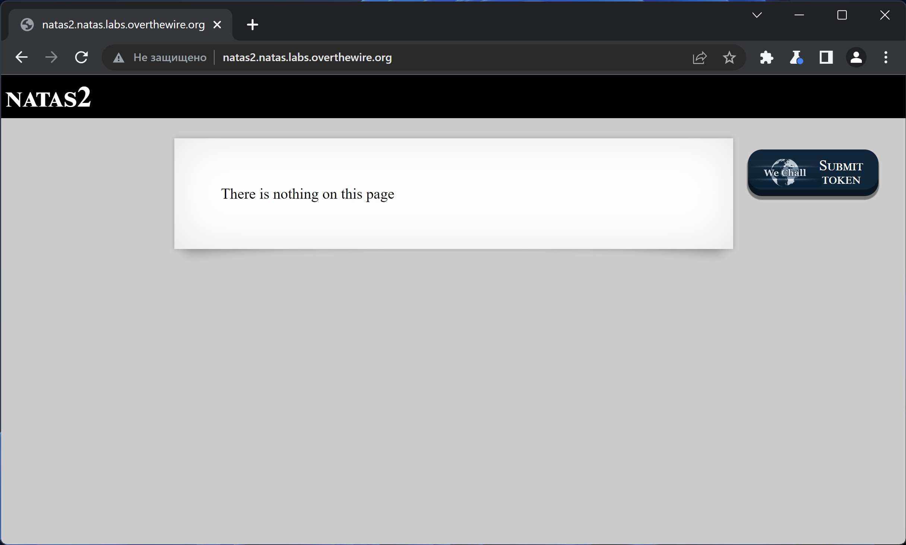
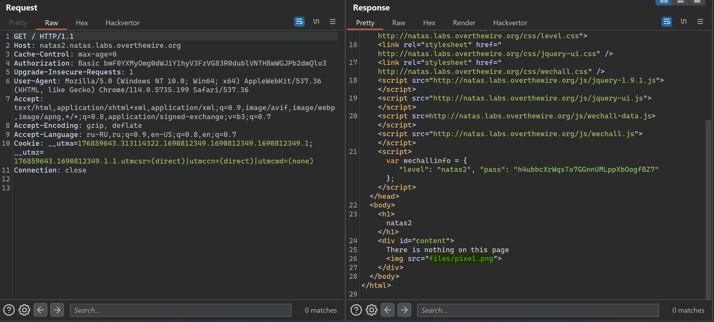
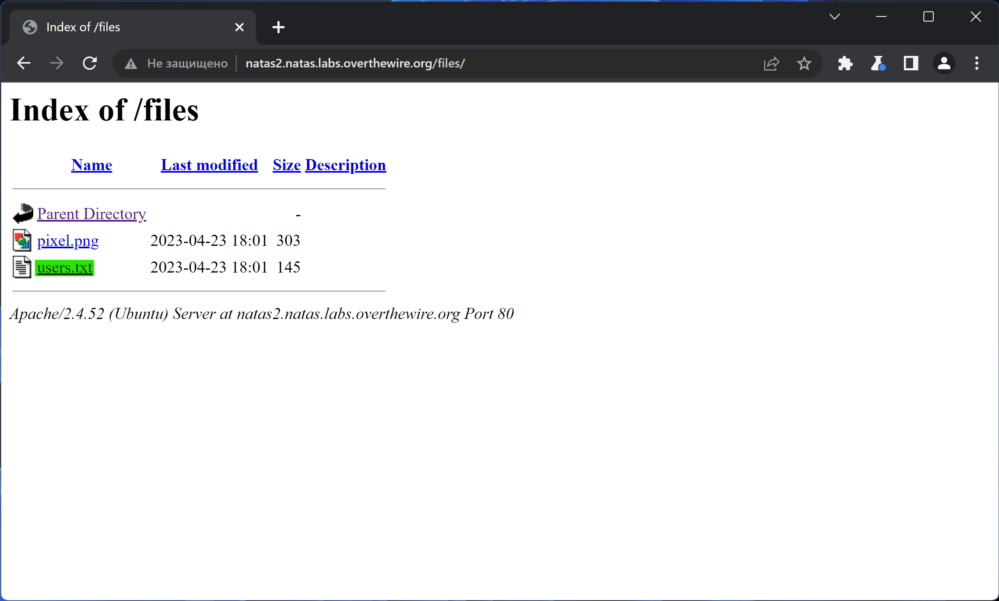
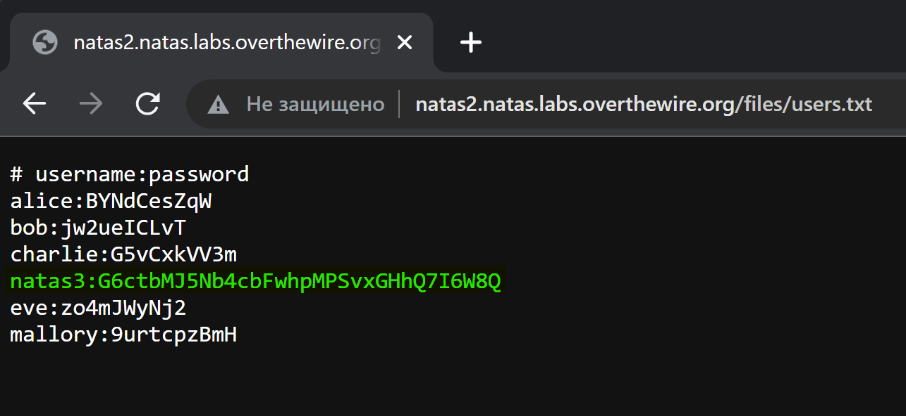

# NATAS_2 WriteUp
:computer: Host: http://natas1.natas.labs.overthewire.org/  
:bust_in_silhouette: Usename: natas2  
:key: Password: h4ubbcXrWqsTo7GGnnUMLppXbOogfBZ7

:triangular_flag_on_post: Flag: G6ctbMJ5Nb4cbFwhpMPSvxGHhQ7I6W8Q 

## Обзор веб-приложения
Веб-приложение выглядит следующим образом

Функционал не представлен никакой

## Решение
В HTML коде страницы содержится ссылка на какой-то файл... Стоит проверить этот путь

В директории ``/files/`` содержится так же файл с искомым флагом

Полученный флаг: G6ctbMJ5Nb4cbFwhpMPSvxGHhQ7I6W8Q