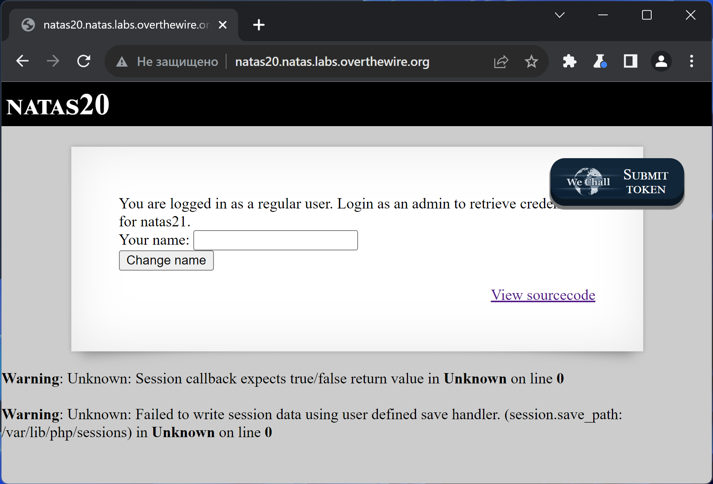
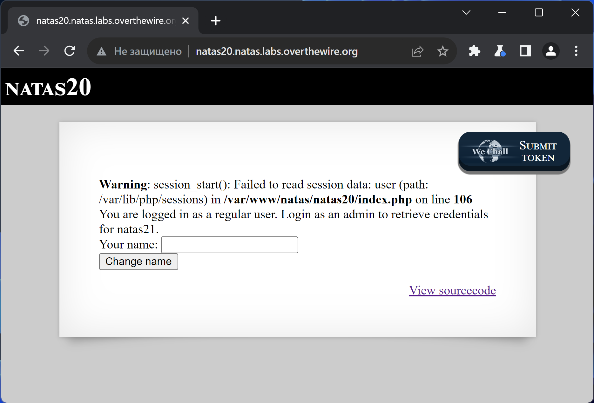
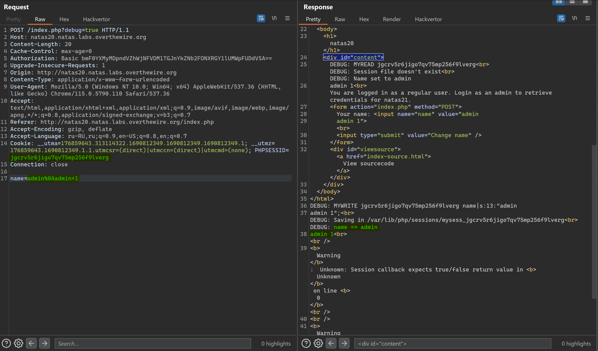
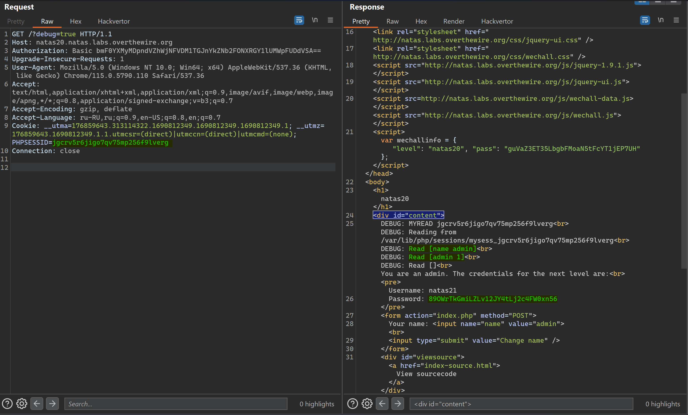

# NATAS_20 WriteUp
:computer: Host: http://natas20.natas.labs.overthewire.org/  
:bust_in_silhouette: Usename: natas20  
:key: Password: guVaZ3ET35LbgbFMoaN5tFcYT1jEP7UH

:triangular_flag_on_post: Flag: 89OWrTkGmiLZLv12JY4tLj2c4FW0xn56
 
- [NATAS\_20 WriteUp](#natas_20-writeup)
  - [Обзор веб-приложения](#обзор-веб-приложения)
  - [Решение](#решение)

## Обзор веб-приложения
<a name="Обзор_веб-приложения"></a> 
Веб-приложение выглядит следующим образом


Ввод учётных данных **test:test** приводит к вот такой реакции


Кнопка <kbd>**View sourcecode**</kbd> позволяет просмотреть исходный код страницы  
```php
// HTML Code ...
<?php
function debug($msg) { /* {{{ */
    if(array_key_exists("debug", $_GET)) {
        print "DEBUG: $msg<br>";
    }
}
/* }}} */
function print_credentials() { /* {{{ */
    if($_SESSION and array_key_exists("admin", $_SESSION) and $_SESSION["admin"] == 1) {
    print "You are an admin. The credentials for the next level are:<br>";
    print "<pre>Username: natas21\n";
    print "Password: <censored></pre>";
    } else {
    print "You are logged in as a regular user. Login as an admin to retrieve credentials for natas21.";
    }
}
/* }}} */

/* we don't need this */
function myopen($path, $name) {
    //debug("MYOPEN $path $name");
    return true;
}

/* we don't need this */
function myclose() {
    //debug("MYCLOSE");
    return true;
}

function myread($sid) {
    debug("MYREAD $sid");
    if(strspn($sid, "1234567890qwertyuiopasdfghjklzxcvbnmQWERTYUIOPASDFGHJKLZXCVBNM-") != strlen($sid)) {
    debug("Invalid SID");
        return "";
    }
    $filename = session_save_path() . "/" . "mysess_" . $sid;
    if(!file_exists($filename)) {
        debug("Session file doesn't exist");
        return "";
    }
    debug("Reading from ". $filename);
    $data = file_get_contents($filename);
    $_SESSION = array();
    foreach(explode("\n", $data) as $line) {
        debug("Read [$line]");
    $parts = explode(" ", $line, 2);
    if($parts[0] != "") $_SESSION[$parts[0]] = $parts[1];
    }
    return session_encode();
}

function mywrite($sid, $data) {
    // $data contains the serialized version of $_SESSION
    // but our encoding is better
    debug("MYWRITE $sid $data");
    // make sure the sid is alnum only!!
    if(strspn($sid, "1234567890qwertyuiopasdfghjklzxcvbnmQWERTYUIOPASDFGHJKLZXCVBNM-") != strlen($sid)) {
    debug("Invalid SID");
        return;
    }
    $filename = session_save_path() . "/" . "mysess_" . $sid;
    $data = "";
    debug("Saving in ". $filename);
    ksort($_SESSION);
    foreach($_SESSION as $key => $value) {
        debug("$key => $value");
        $data .= "$key $value\n";
    }
    file_put_contents($filename, $data);
    chmod($filename, 0600);
}

/* we don't need this */
function mydestroy($sid) {
    //debug("MYDESTROY $sid");
    return true;
}
/* we don't need this */
function mygarbage($t) {
    //debug("MYGARBAGE $t");
    return true;
}

session_set_save_handler(
    "myopen",
    "myclose",
    "myread",
    "mywrite",
    "mydestroy",
    "mygarbage");
session_start();

if(array_key_exists("name", $_REQUEST)) {
    $_SESSION["name"] = $_REQUEST["name"];
    debug("Name set to " . $_REQUEST["name"]);
}

print_credentials();
$name = "";
if(array_key_exists("name", $_SESSION)) {
    $name = $_SESSION["name"];
}
?>
// HTML Code ...
```

## Решение
<a name="Решение"></a>
В данном веб-приложении переопределены функции управления сессией пользователя  
В частности, описаны функции чтения и записи сессии пользователя

Запись информации о сессии реализована не сложно: пробегаемся по парам ``$key => $value`` и записываем их через пробел  
Строка должна заканчиваться на **\n**
```php
$filename = session_save_path() . "/" . "mysess_" . $sid;
$data = "";
debug("Saving in ". $filename);
ksort($_SESSION);
foreach($_SESSION as $key => $value) {
    debug("$key => $value");
    $data .= "$key $value\n";
}
```

Функция **myread**, соответственно, учитывает эти особенности записи во время чтения информации из файла сессии  
```php
$data = file_get_contents($filename);
$_SESSION = array();
foreach(explode("\n", $data) as $line) {
    debug("Read [$line]");
    $parts = explode(" ", $line, 2);
    if($parts[0] != "") $_SESSION[$parts[0]] = $parts[1];
}
```

Определение администратора происходит через проверку наличия в файле сессии строчки **"admin 1"**
```php
function print_credentials() { /* {{{ */
    if($_SESSION and array_key_exists("admin", $_SESSION) and $_SESSION["admin"] == 1) {
        print "You are an admin. The credentials for the next level are:<br>";
        print "<pre>Username: natas21\n";
        print "Password: <censored></pre>";
    } else {
        print "You are logged in as a regular user. Login as an admin to retrieve credentials for natas21.";
    }
}
```

Попробуем же дописать в свой файл сессии необходимую строчку с помощью символа переноса строки - ``\n``   
:space_invader: Payload: ``name=admin%0Aadmin+1``   



А теперь попробуем зайти, используя тот же **PHPSESSID**, под которым мы применяли payload 


Полученный флаг: 89OWrTkGmiLZLv12JY4tLj2c4FW0xn56
