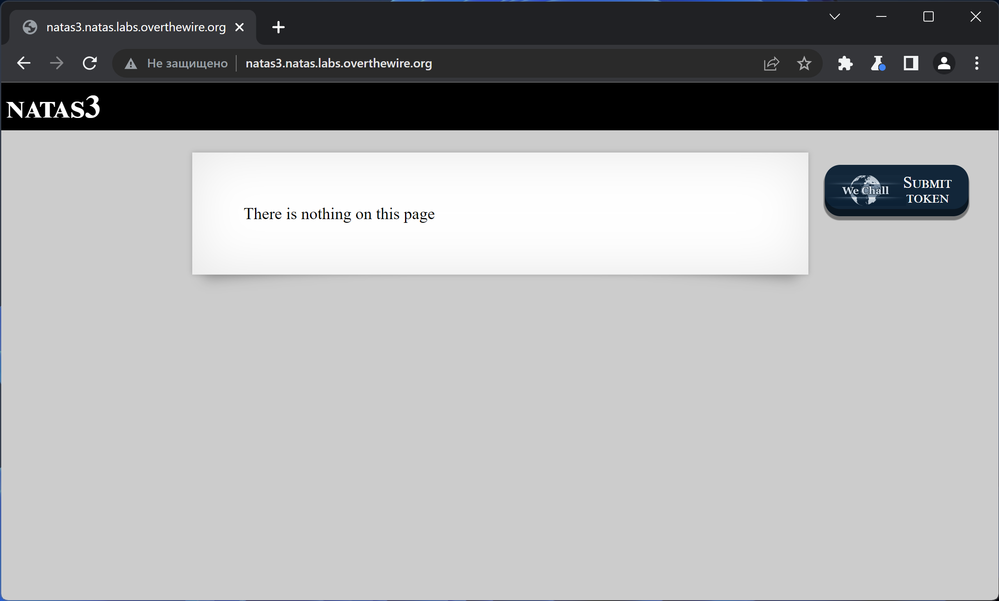
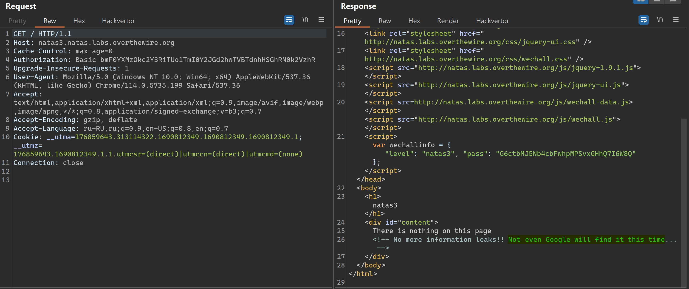
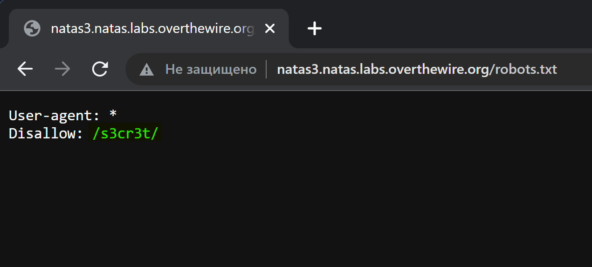
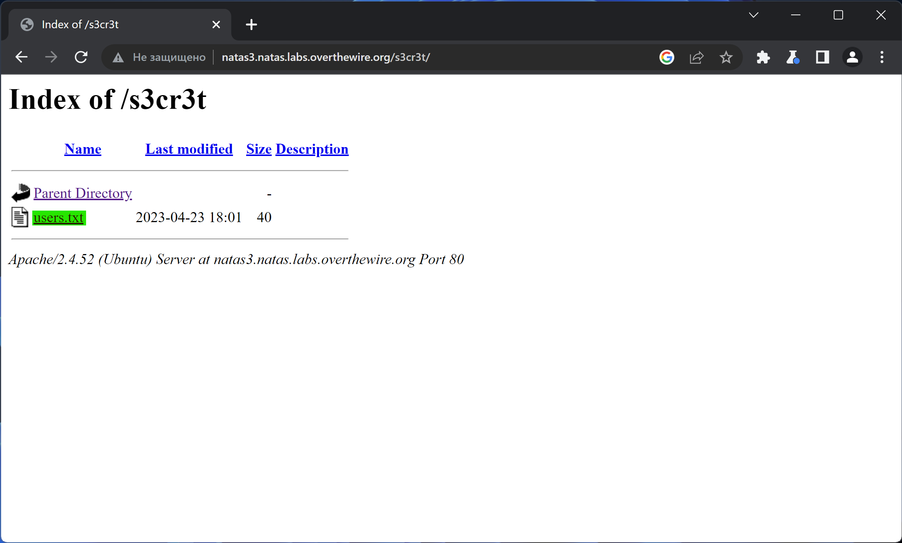
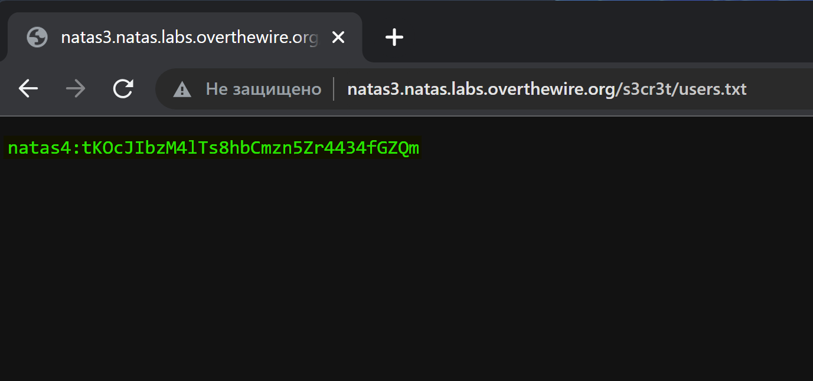

# NATAS_3 WriteUp
:computer: Host: http://natas3.natas.labs.overthewire.org/  
:bust_in_silhouette: Usename: natas3  
:lock: Password: G6ctbMJ5Nb4cbFwhpMPSvxGHhQ7I6W8Q

:triangular_flag_on_post: Flag: tKOcJIbzM4lTs8hbCmzn5Zr4434fGZQm

## Обзор веб-приложения
Веб-приложение выглядит следующим образом

Функционал не представлен никакой

## Решение
В HTML коде страницы видим комментарий с намёком на то, что стоит проверить ``/robots.txt``

В файле ``robots.txt`` находим указание на секретный ресурс

На секретном ресурсе видим файл ``users.txt``

А в файле ``users.txt`` видим флаг

Полученный флаг: tKOcJIbzM4lTs8hbCmzn5Zr4434fGZQm