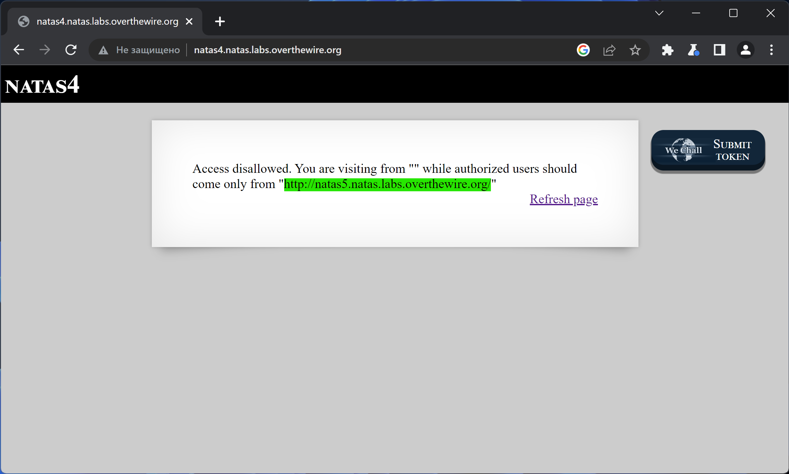
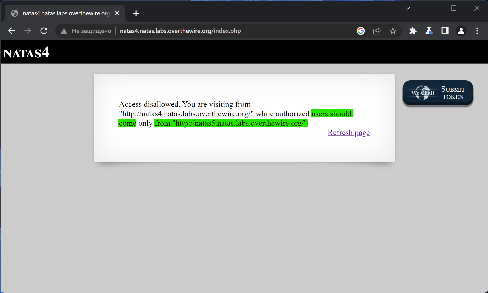
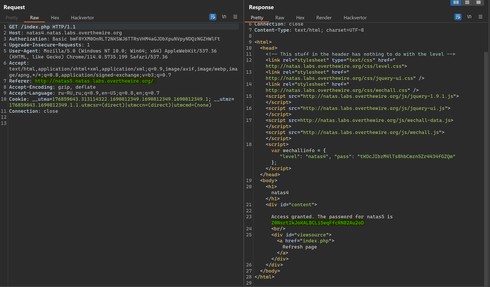

# NATAS_4 WriteUp
:computer: Host: http://natas4.natas.labs.overthewire.org/  
:bust_in_silhouette: Usename: natas4  
:lock: Password: tKOcJIbzM4lTs8hbCmzn5Zr4434fGZQm

:triangular_flag_on_post: Flag: Z0NsrtIkJoKALBCLi5eqFfcRN82Au2oD

## Обзор веб-приложения
Веб-приложение выглядит следующим образом:

Доступна кнопка "Refresh page", ведущая на страницу ``/index.php``  
При нажатии на "Refresh page" страница ``index.php`` отдаёт нам сообщение, что мы перешли на неё с неправильного источника.

## Решение
Перехватим запрос в Burp Suite и попробуем подменить заголовок ``Referer`` на предложенный веб-приложением (``http://natas5.natas.labs.overthewire.org/``).  
В ответ веб-приложение отдаёт нам флаг:

Полученный флаг: Z0NsrtIkJoKALBCLi5eqFfcRN82Au2oD