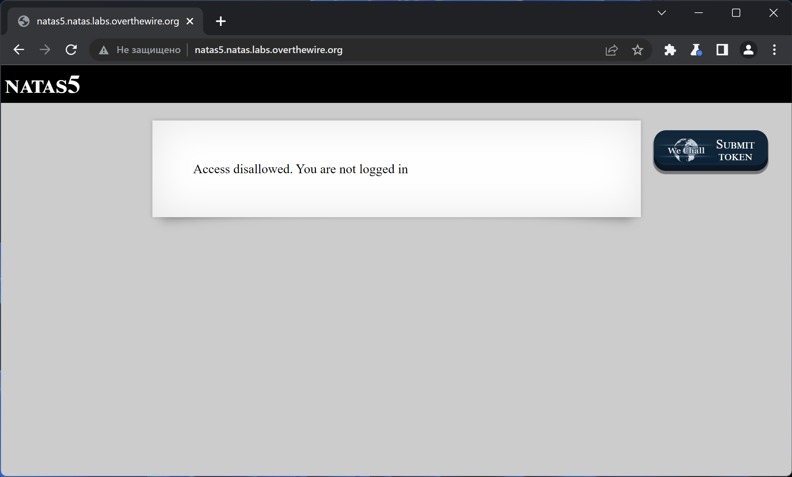
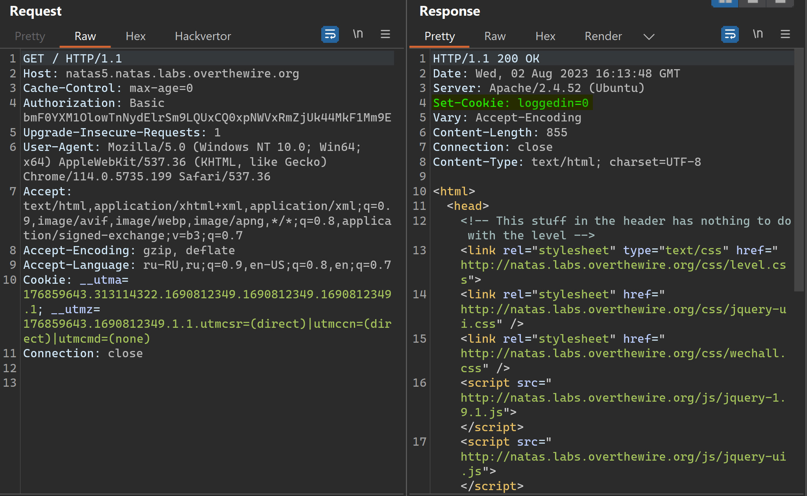
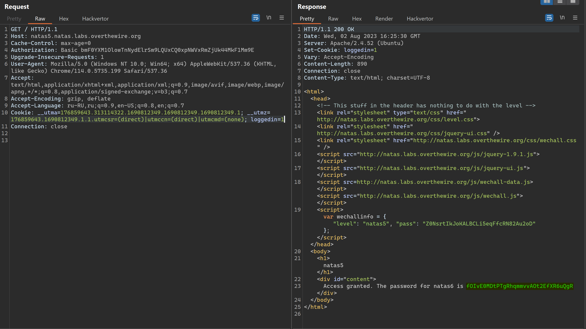

# NATAS_5 WriteUp
:computer: Host: http://natas5.natas.labs.overthewire.org/  
:bust_in_silhouette: Usename: natas5  
:lock: Password: Z0NsrtIkJoKALBCLi5eqFfcRN82Au2oD

:triangular_flag_on_post: Flag: fOIvE0MDtPTgRhqmmvvAOt2EfXR6uQgR

## Обзор веб-приложения
Веб-приложение выглядит следующим образом:

Больше никакого функционала, на первый взгляд, нет.

## Прохождение
Перехватим запрос в Burp Suite и увидим, что веб-приложение устанавливает нам куку ``loggedin``, установленную в "0". 

Попробуем выставить эту куку в "1" и увидим, что теперь в ответ веб-приложение отдаёт нам флаг:

Полученный флаг: fOIvE0MDtPTgRhqmmvvAOt2EfXR6uQgR
