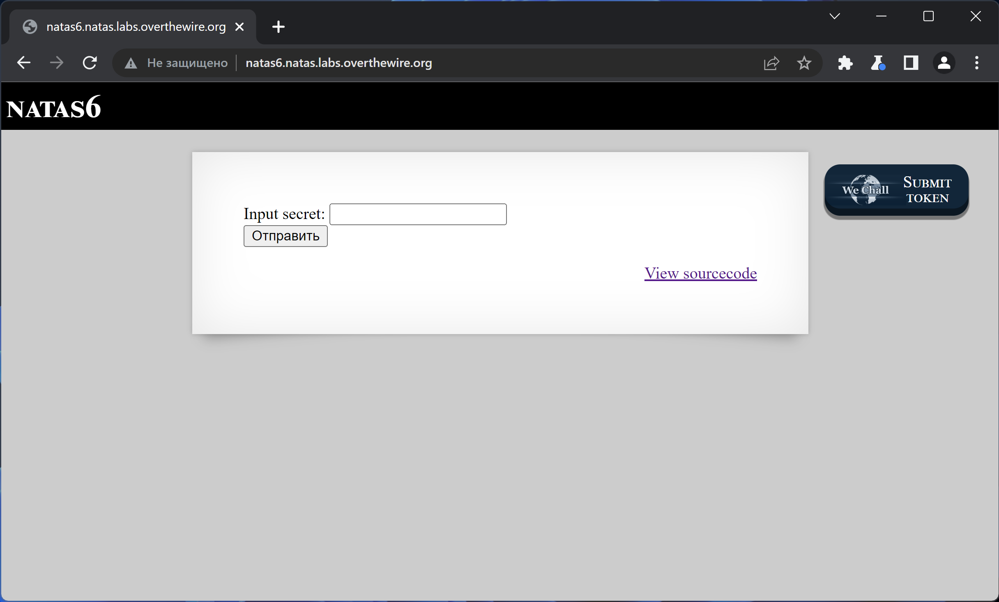
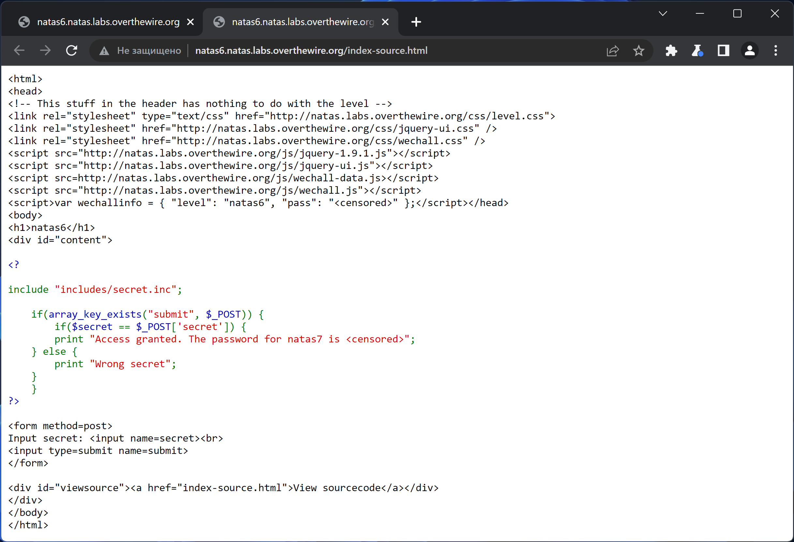
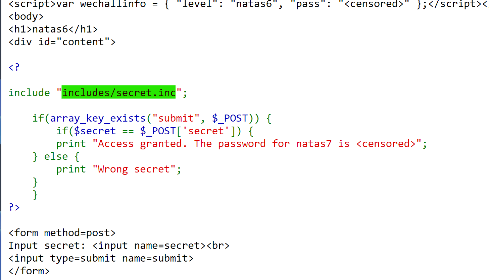
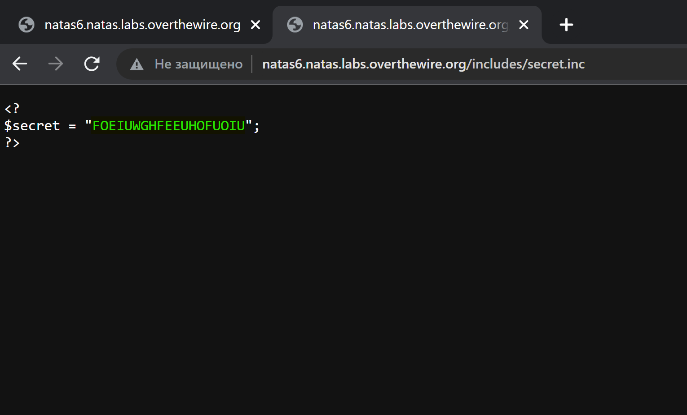
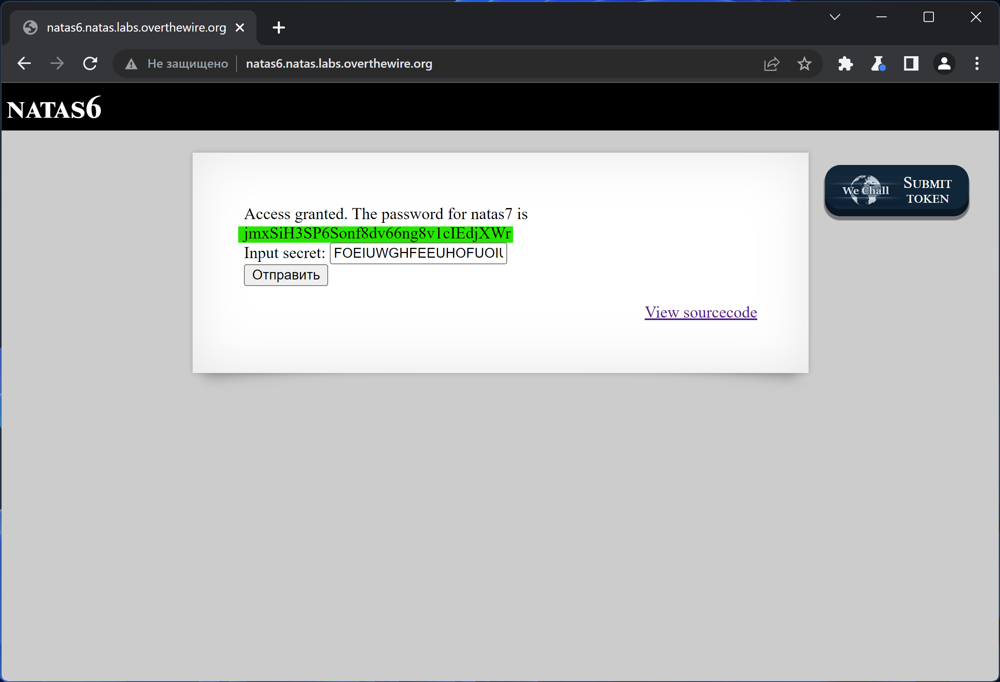

# NATAS_6 WriteUp
:computer: Host: http://natas6.natas.labs.overthewire.org/  
:bust_in_silhouette: Usename: natas6  
:lock: Password: fOIvE0MDtPTgRhqmmvvAOt2EfXR6uQgR

:triangular_flag_on_post: Flag: jmxSiH3SP6Sonf8dv66ng8v1cIEdjXWr

## Обзор веб-приложения
Веб-приложение выглядит следующим образом

Форма ввода секретного слова в самом деле работает. Ввод слова ``test`` привёл к вот такой реакции  

Кнопка <kbd>**View sourcecode**</kbd> позволяет просмотреть исходный код страницы

## Решение
В исходном коде мы видим директиву ``include``, которая подключает какой-то ``secret.inc``

Проверим этот файл и получим в ответ секретное слово - ``FOEIUWGHFEEUHOFUOIU``
  

Введём этот секрет на главной странице и получим в ответ флаг
  

Полученный флаг: jmxSiH3SP6Sonf8dv66ng8v1cIEdjXWr
