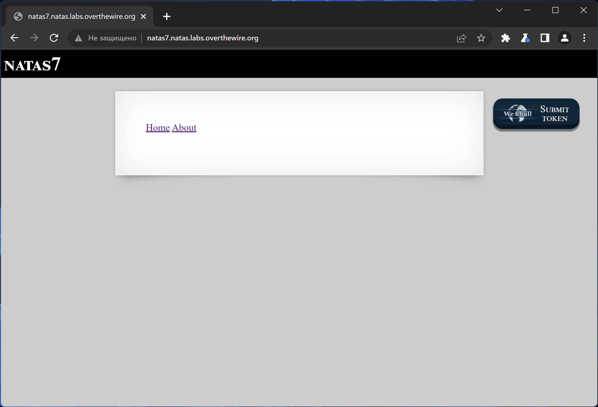
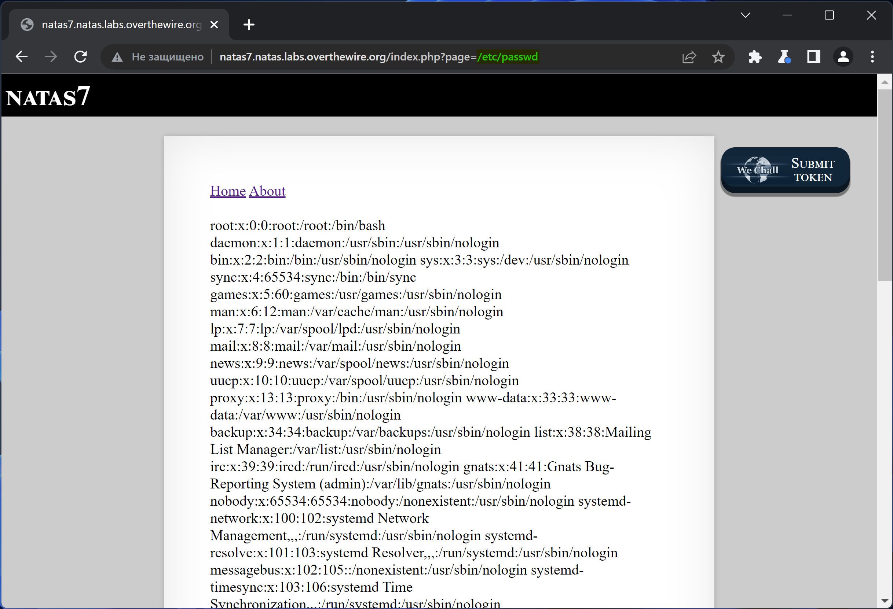
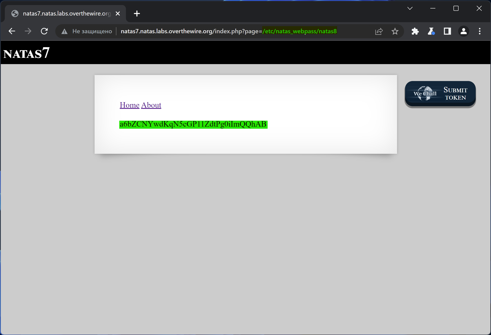

# NATAS_7 WriteUp
:computer: Host: http://natas7.natas.labs.overthewire.org/  
:bust_in_silhouette: Usename: natas7  
:key: Password: jmxSiH3SP6Sonf8dv66ng8v1cIEdjXWr

:triangular_flag_on_post: Flag: a6bZCNYwdKqN5cGP11ZdtPg0iImQQhAB

- [NATAS\_7 WriteUp](#natas_7-writeup)
  - [Обзор веб-приложения](#обзор-веб-приложения)
  - [Решение](#решение)

## Обзор веб-приложения
 
Веб-приложение выглядит следующим образом

Кнопка <kbd>**Home**</kbd> отправляет на такую страничку

Кнопка <kbd>**About**</kbd> отправляет на такую страничку

## Решение

Переход на разные страници реализован через обработку на стороне сервера параметра ``page``. Если мы передадим в нём абсолютный путь к любому другому файлу на сервере, он будет прочитан и возвращён на страницу в ответе

Флаги находятся в директории ``/etc/natas_webpass/``. Вытащим флаг этой лабораторки *(он же пароль от natas8)*

Полученный флаг: a6bZCNYwdKqN5cGP11ZdtPg0iImQQhAB
