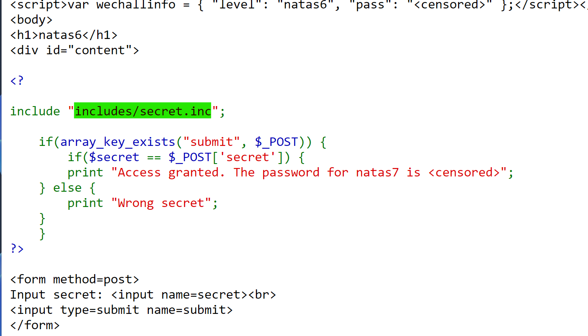

# NATAS_7 WriteUp
:computer: Host: http://natas7.natas.labs.overthewire.org/  
:bust_in_silhouette: Usename: natas7  
:lock: Password: jmxSiH3SP6Sonf8dv66ng8v1cIEdjXWr

:triangular_flag_on_post: Flag: 

## Обзор веб-приложения
Веб-приложение выглядит следующим образом:

## Прохождение
В исходном коде мы видим директиву ``include``, которая подключает какой-то ``secret.inc``:

Полученный флаг: 
