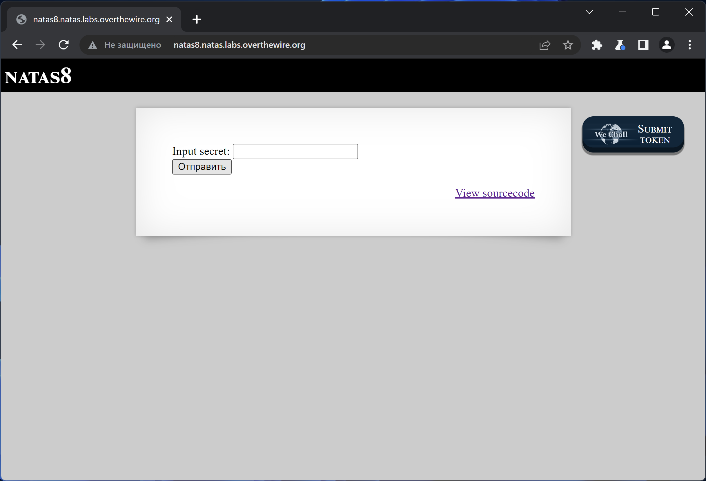
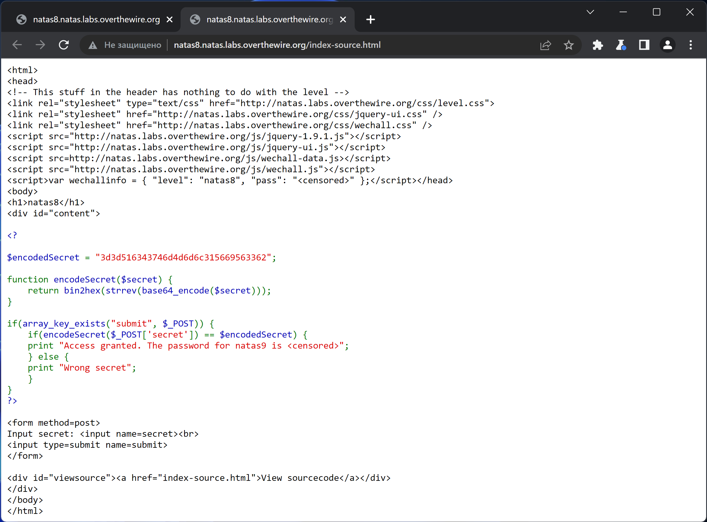
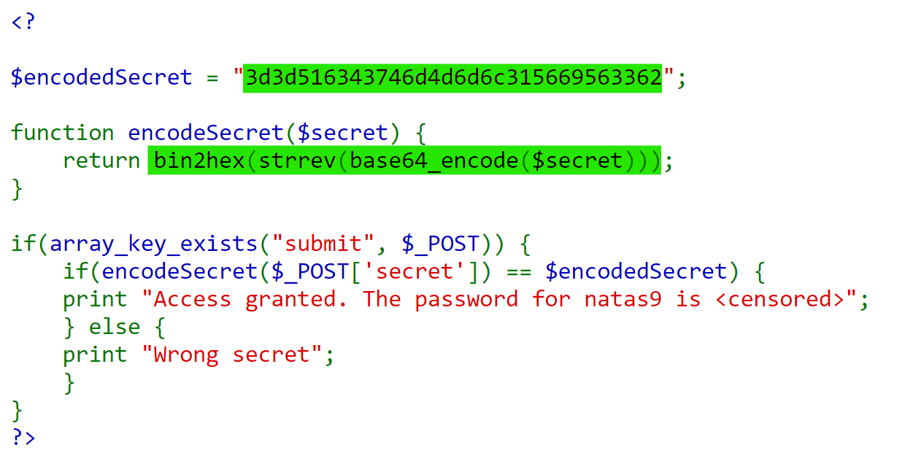
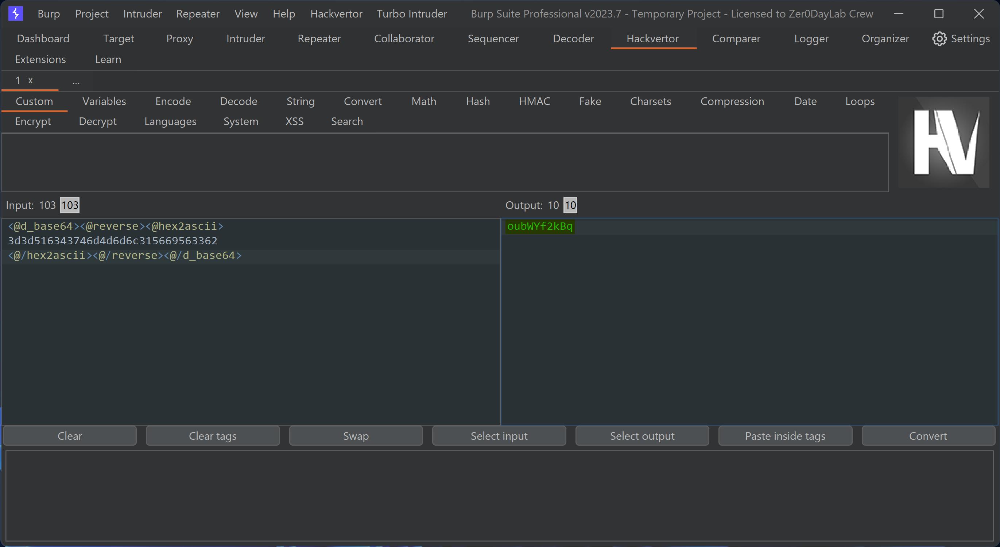
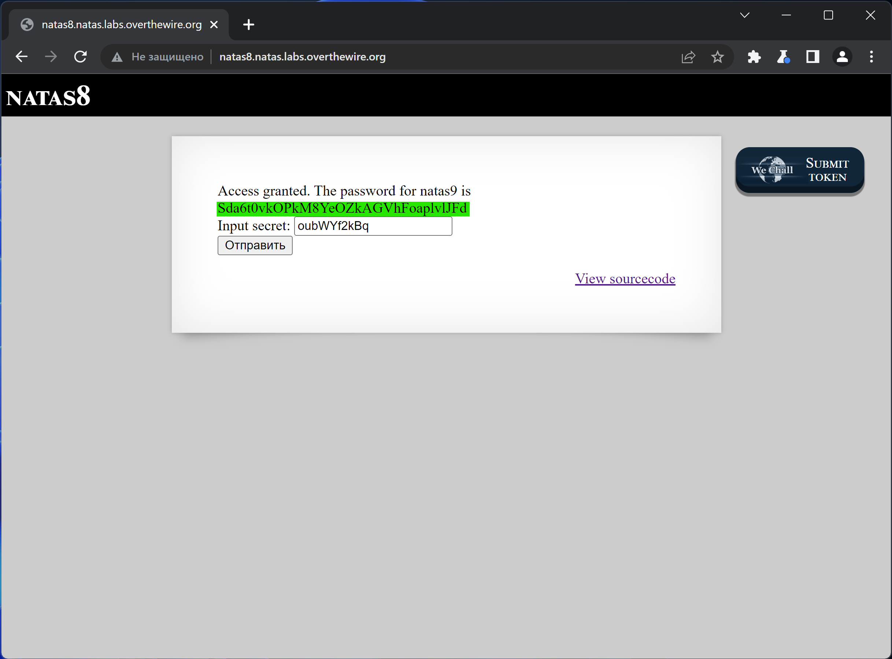

# NATAS_8 WriteUp
:computer: Host: http://natas8.natas.labs.overthewire.org/  
:bust_in_silhouette: Usename: natas8  
:lock: Password: a6bZCNYwdKqN5cGP11ZdtPg0iImQQhAB

:triangular_flag_on_post: Flag: Sda6t0vkOPkM8YeOZkAGVhFoaplvlJFd

## Обзор веб-приложения
Веб-приложение выглядит следующим образом:

Ввод слова ``test`` привёл к вот такой реакции:  

Кнопка <kbd>View sourcecode</kbd> позволяет просмотреть исходный код страницы:

## Решение
В коде элемента видим зашифрованную секретную строку и алгоритм, по которому секрет был зашифрован:

Проведём обратное преобразование и получим секретную строку - ``oubWYf2kBq``

Отправим полученный секрет в форму веб-приложения и получим в ответ флаг

Полученный флаг: Sda6t0vkOPkM8YeOZkAGVhFoaplvlJFd
