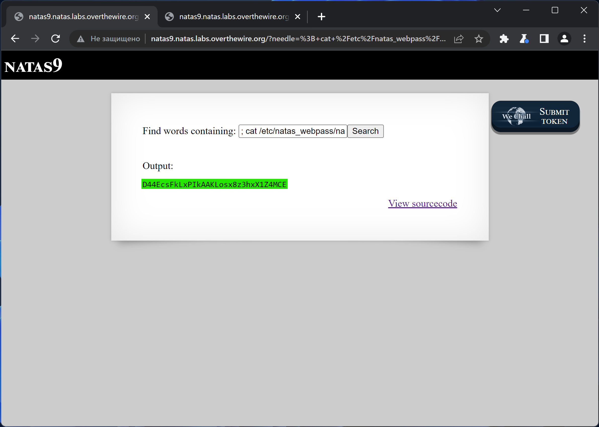

# NATAS_9 WriteUp
:computer: Host: http://natas9.natas.labs.overthewire.org/  
:bust_in_silhouette: Usename: natas9  
:lock: Password: Sda6t0vkOPkM8YeOZkAGVhFoaplvlJFd

:triangular_flag_on_post: Flag: D44EcsFkLxPIkAAKLosx8z3hxX1Z4MCE

## Обзор веб-приложения
Веб-приложение выглядит следующим образом:

Ввод слова ``test`` привёл к вот такой реакции:  

Кнопка <kbd>View sourcecode</kbd> позволяет просмотреть исходный код страницы:

## Решение
В исходном коде веб-приложения видим команду, которая выполняет поиск по вводимому пользователем слову:

Выводим флаг от этой лабораторки при помощи уязвимости Command Injection  
:space_invader: Payload: ``; cat /etc/natas_webpass/natas10; # ``

Полученный флаг: D44EcsFkLxPIkAAKLosx8z3hxX1Z4MCE
